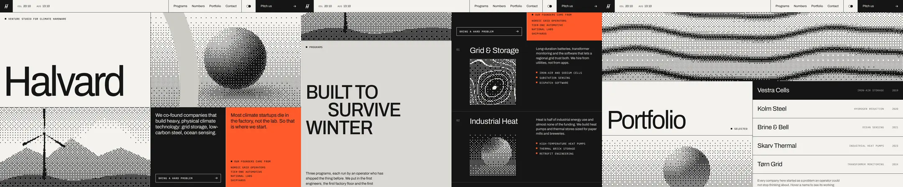

# Dither Tile Grid

The page is a ruled grid of flat tiles: paper, ink, one loud accent, and a few tiles that hold **images rendered as 1-bit ordered dither**. The dither is the art direction. It turns mismatched photos, renders and diagrams into one visual family, makes them sit on the same grid as the type, and gives the brand a printed, engineered texture that no stock photo has.

Reference pattern: technical, high-trust brands (executive search, deep tech, climate hardware, research labs) that pair a huge neo-grotesk wordmark, mono uppercase labels with square bullets, and halftone image tiles with a flat brand shape laid over the dots.

Use this skill when the brief says: "editorial", "Swiss", "technical", "engineered", "print", "halftone", "dither", "1-bit", "we have no good photography", or points at a reference like this. Do not use it for food, fashion, hospitality or anything where real color and skin tones sell the product: dithering throws those away.

---

## 1. The Rules That Make It Look Expensive

1. **Ordered, not random.** Use an 8x8 Bayer matrix. It gives the regular, woven texture of print. Random (white noise) dither reads as TV static; error diffusion (Floyd-Steinberg) crawls and shimmers when the source animates.
2. **The dot is a design unit: 3 CSS px.** 2px turns to gray mush on most screens, 4px looks like a retro game. Snap it so `dot * devicePixelRatio` is a whole number, and size the canvas to an exact multiple of the dot, so no column ever renders 4px wide next to 3px ones.
3. **Two colors only, both from CSS.** The dots take the tile's `color`, the paper takes its `background-color`. No gray dots, no anti-aliasing (`image-rendering: pixelated`). Theme switches and dark cells come for free.
4. **Coverage means darkness, on every surface.** Dot coverage = image darkness, in light and dark theme alike. A tile then keeps the same ink density in both themes and reads as a print negative on dark surfaces. Flip it back (`trueTone`) only for photographs of people.
5. **Tone the source for the dither.** Fields and photos must live mostly between 0.15 and 0.9 luminance and avoid large flat 50 percent areas: Bayer at exactly 50 percent is a checkerboard that buzzes. Add a rim or bounce light so dark sides are never solid ink. Contrast 1.15 around mid gray.
6. **Hairlines are a gap, not borders.** `display: grid; gap: 1px; background: ink` with every child on paper. Lines never double, never drift by subpixels, and nested grids inherit them.
7. **One flat shape over the dots.** A large brand shape in a flat mid tone (`--flat`, about 12 percent off paper) laid over the dither as crisp SVG. It is the signature layer: the photo becomes texture, the shape becomes the image.
8. **Tile palette: paper, tile gray, ink, one accent.** Paper `#F3F2EE`, tile `#DAD9D4`, ink `#151515`, accent signal orange `#FF5A2B` with ink text (5.9:1). At most one accent tile per viewport.
9. **Type does the rest.** One neo-grotesk (Archivo here) for everything large, weight 400, tracking -0.035 to -0.055em, line-height 0.78 to 0.9. One mono (IBM Plex Mono) at 12px uppercase, tracking 0.06em, with a 7px square bullet. Nothing in between.
10. **Motion is print-native.** Tiles *dither in*: dots appear in Bayer order, sweeping top to bottom over 0.9s. Idle motion only moves the light inside a field, never the layout. The pointer is a soft light that opens the dots (radius 24 percent of the short side).

---

## 2. Layout Blueprint

```
┌────┬──────────────────────────┬──────────────────────────────┬────┬───────────┐
│ ▞  │ OSL 14:06   AUS 07:06    │ Programs Numbers Portfolio … │ ◐● │ Pitch us →│  sticky, 60px, ruled cells
├────┴──────────────────────────┼──────────────────────────────┴────┴───────────┤
│ ■ VENTURE STUDIO FOR …        │ ░░▒▒▓▓ dither: lit sphere ▓▓▒▒░░  ▌flat shape │  row 1: 54vh
│                               │                                               │
│ Halvard                       │                                               │  wordmark 14vw, lh .78
├───────────────────────────────┼───────────────────────┬───────────────────────┤
│ ░▒▓ dither: image (ridge) ▓▒░ │ INK: lede + outline   │ ACCENT: claim +       │  row 2: 46vh
│                               │ button                │ mono list             │
└───────────────────────────────┴───────────────────────┴───────────────────────┘
 TILE GRAY sticky display type  │ INK list: 01 title / dither plate / copy / ■ bullets
 4 stat cells (one ink, one accent) / full-width dither band
 "Portfolio" + preview dither   │ rows: name · MONO CATEGORY · year (hover = ink row, preview swaps)
 ACCENT contact cell            │ dither (dawn) + flat shape
```

- 50/50 split down the whole page. The right column alternates ink and paper; the left alternates paper and tile gray. Accent appears in exactly two places.
- Every image tile is edge-to-edge in its cell: no padding, no radius, no shadow. The grid line is the frame.
- Big words (`Halvard`, `Portfolio`) sit at the bottom-left of tall cells; small mono labels sit at the top-left. The empty middle is the luxury.
- Mobile (< 820px): one column, image tiles get `aspect-ratio: 5/4`, the second clock and the nav hide, the wordmark goes to 29vw.

---

## 3. Stack

- Canvas 2D only. No WebGL, no library. One `ImageData` per tile, written as `Uint32Array`, scaled up with CSS.
- `IntersectionObserver` (show / pause), `ResizeObserver` (re-grid), one shared `requestAnimationFrame` loop capped at 30fps.
- Fonts: Archivo (variable, `wdth` 62 to 125) and IBM Plex Mono 400/500 from Google Fonts.
- Next.js / React: mount tiles in a client component's `useEffect`, call `mountDither(ref.current, field)`, and remove the tile from the set on unmount.

---

## 4. CSS: Grid and Tile

```css
/* ---------- Hairline grid: gap on an ink background, never borders ---------- */
.g { display: grid; gap: 1px; background: var(--rule); border-bottom: 1px solid var(--rule); }
.g > * { background: var(--paper); min-width: 0; }
.g .g { border-bottom: 0; }

.label {
  font: 500 12px/1.3 var(--mono); letter-spacing: .06em; text-transform: uppercase;
  display: inline-flex; align-items: center; gap: 10px; margin: 0;
}
.label::before { content: ''; width: 7px; height: 7px; background: currentColor; flex: none; }
.bullets { list-style: none; margin: 0; padding: 0; display: grid; gap: 8px; }
.bullets li { font: 400 12.5px/1.3 var(--mono); letter-spacing: .05em; text-transform: uppercase; display: flex; gap: 10px; }
.bullets li::before { content: ''; width: 7px; height: 7px; margin-top: 3px; background: var(--accent); flex: none; }
/* ---------- Dither tile ---------- */
.dither {
  position: relative; overflow: hidden; isolation: isolate;
  /* No-JS / no-canvas fallback: a fading CSS halftone in the same colors */
  background:
    linear-gradient(to bottom, var(--paper) 0%, transparent 70%),
    radial-gradient(circle, var(--ink) 0.8px, transparent 1.2px) 0 0 / 3px 3px;
  background-color: var(--paper);
  color: var(--ink);
}
.dither canvas {
  position: absolute; left: 0; top: 0; z-index: -1;
  image-rendering: crisp-edges; image-rendering: pixelated; /* Firefox reads the first, Chromium and Safari the second */
}
.dither .flat { position: absolute; inset: 0; width: 100%; height: 100%; fill: var(--flat); pointer-events: none; }
```

The fallback background is a fading CSS halftone in the same two colors. If JavaScript or the 2D context fails, the tile still looks intentional.

Tiles inside dark cells set their own colors; the engine reads them, nothing else changes:

```css
.program .dither { width: min(100%, 220px); aspect-ratio: 1; background-color: var(--ink); color: var(--paper);
  background-image: linear-gradient(to bottom, var(--ink) 0%, transparent 70%), radial-gradient(circle, var(--paper) 0.8px, transparent 1.2px); }
```

---

## 5. The Engine (complete)

```js
const BAYER = [
   0, 32,  8, 40,  2, 34, 10, 42,
  48, 16, 56, 24, 50, 18, 58, 26,
  12, 44,  4, 36, 14, 46,  6, 38,
  60, 28, 52, 20, 62, 30, 54, 22,
   3, 35, 11, 43,  1, 33,  9, 41,
  51, 19, 59, 27, 49, 17, 57, 25,
  15, 47,  7, 39, 13, 45,  5, 37,
  63, 31, 55, 23, 61, 29, 53, 21,
].map((v) => (v + 0.5) / 64);

const reduce = matchMedia('(prefers-reduced-motion: reduce)').matches;
const rgb = (s) => s.match(/[\d.]+/g).slice(0, 3).map(Number);
const pack = ([r, g, b]) => ((255 << 24) | (b << 16) | (g << 8) | r) >>> 0; // ImageData is RGBA bytes, little-endian u32
const luma = ([r, g, b]) => (0.2126 * r + 0.7152 * g + 0.0722 * b) / 255;

// Snap the dot so dot * devicePixelRatio is a whole number of device pixels.
const dotSize = (css = 3) => Math.max(1, Math.round(css * devicePixelRatio)) / devicePixelRatio;

export class DitherTile {
  constructor(el, field, { dot = 3, drift = true, contrast = 1.15, trueTone = false } = {}) {
    this.el = el; this.field = field; this.dotCss = dot; this.drift = drift && !reduce; this.contrast = contrast; this.trueTone = trueTone;
    this.canvas = document.createElement('canvas');
    this.canvas.setAttribute('aria-hidden', 'true');
    this.ctx = this.canvas.getContext('2d', { alpha: false });
    if (!this.ctx) throw new Error('2d context unavailable');
    el.prepend(this.canvas);
    this.reveal = reduce ? 1 : 0; this.revealing = false;
    this.pointer = { x: 0, y: 0, k: 0, target: 0 };
    this.visible = false; this.dirty = true; this.t = 0;
    this.readColors(); this.resize();

    el.addEventListener('pointermove', (e) => {
      const r = el.getBoundingClientRect();
      this.pointer.x = (e.clientX - r.left) / this.dot;
      this.pointer.y = (e.clientY - r.top) / this.dot;
      this.pointer.target = 1; this.dirty = true;
    }, { passive: true });
    el.addEventListener('pointerleave', () => { this.pointer.target = 0; });
  }

  // Dots take the element's own `color`, the paper takes its `background-color`.
  // Default: dot coverage = image darkness on every surface, so a tile keeps the same
  // ink density in both themes (on a dark surface it reads as a print negative).
  // `trueTone` flips the mapping on dark surfaces so light stays light: use it for photos of people.
  readColors() {
    const cs = getComputedStyle(this.el);
    const ink = rgb(cs.color), paper = rgb(cs.backgroundColor);
    this.ink = pack(ink); this.paper = pack(paper);
    this.invert = this.trueTone && luma(paper) < 0.5;
    this.dirty = true;
  }

  resize() {
    this.dot = dotSize(this.dotCss);
    const r = this.el.getBoundingClientRect();
    const w = Math.max(1, Math.ceil(r.width / this.dot));
    const h = Math.max(1, Math.ceil(r.height / this.dot));
    if (w === this.w && h === this.h) return;
    this.w = w; this.h = h;
    this.canvas.width = w; this.canvas.height = h;
    // Exact multiple of the dot: no uneven columns from fractional scaling. The overflow is clipped.
    this.canvas.style.width = `${w * this.dot}px`;
    this.canvas.style.height = `${h * this.dot}px`;
    this.img = this.ctx.createImageData(w, h);
    this.px = new Uint32Array(this.img.data.buffer);
    this.dirty = true;
  }

  setField(field) {
    this.field = field;
    if (!reduce) { this.reveal = 0; this.revealing = this.visible; }
    this.dirty = true;
  }

  show() {
    this.visible = true;
    if (this.reveal < 1) this.revealing = true;
  }

  step(dt) {
    if (!this.visible) return;
    const p = this.pointer;
    let needs = this.dirty;
    if (this.revealing) {
      this.reveal = Math.min(1, this.reveal + dt / 0.9);
      if (this.reveal === 1) this.revealing = false;
      needs = true;
    }
    if (this.drift) { this.t += dt; needs = true; }
    const dk = p.target - p.k;
    if (Math.abs(dk) > 0.002) { p.k += dk * Math.min(1, dt * 6); needs = true; }
    if (needs) { this.render(); this.dirty = false; }
  }

  render() {
    const { w, h, px, field, ink, paper, invert, contrast, reveal, t } = this;
    const aspect = w / h, p = this.pointer, k = p.k;
    const lr2 = Math.pow(0.24 * Math.min(w, h), 2);
    let i = 0;
    for (let y = 0; y < h; y++) {
      const v = y / h, row = (y & 7) << 3;
      // Reveal: Bayer order decides which dots may appear, sweeping top to bottom.
      const gate = Math.min(1, Math.max(0, reveal * 1.6 - v * 0.6));
      for (let x = 0; x < w; x++, i++) {
        const b = BAYER[row | (x & 7)];
        if (b >= gate) { px[i] = paper; continue; }
        let lum = field(x / w, v, t, aspect);
        if (k > 0.002) {
          const dx = x - p.x, dy = y - p.y;
          lum += 0.5 * k * Math.exp(-(dx * dx + dy * dy) / lr2);
        }
        lum = (lum - 0.5) * contrast + 0.5;
        px[i] = (invert ? lum : 1 - lum) > b ? ink : paper;
      }
    }
    this.ctx.putImageData(this.img, 0, 0);
  }
}

// One loop for every tile, capped at 30fps: a 3px dot pattern gains nothing from 60.
const tiles = new Set();
let last = performance.now();
function loop(now) {
  requestAnimationFrame(loop);
  if (document.hidden || now - last < 33) return;
  const dt = Math.min((now - last) / 1000, 0.1);
  last = now;
  for (const tile of tiles) tile.step(dt);
}
requestAnimationFrame(loop);

const io = new IntersectionObserver((entries) => {
  for (const e of entries) {
    const tile = e.target.__dither;
    if (!tile) continue;
    if (e.isIntersecting) tile.show(); else tile.visible = false;
  }
}, { threshold: 0.2 });
const ro = new ResizeObserver((entries) => entries.forEach((e) => e.target.__dither?.resize()));

export function mountDither(el, field, opts) {
  try {
    const tile = new DitherTile(el, field, opts);
    el.__dither = tile; tiles.add(tile); io.observe(el); ro.observe(el);
    return tile;
  } catch (err) {
    return null; // the CSS halftone fallback stays in place
  }
}

export function refreshDitherColors() { tiles.forEach((t) => t.readColors()); }

// Any image becomes a field. Cover-fit, nearest sample, luminance cached once.
// Cross-origin images need CORS headers or getImageData throws.
export function fromImage(img, size = 360) {
  const ar = img.naturalWidth / img.naturalHeight;
  const W = size, H = Math.max(1, Math.round(size / ar));
  const c = document.createElement('canvas');
  c.width = W; c.height = H;
  const ctx = c.getContext('2d', { willReadFrequently: true });
  ctx.drawImage(img, 0, 0, W, H);
  const d = ctx.getImageData(0, 0, W, H).data;
  const lum = new Float32Array(W * H);
  for (let i = 0; i < lum.length; i++) lum[i] = (0.2126 * d[i * 4] + 0.7152 * d[i * 4 + 1] + 0.0722 * d[i * 4 + 2]) / 255;
  return (u, v, t, aspect) => {
    let su = u, sv = v;
    if (aspect > ar) sv = 0.5 + (v - 0.5) * (ar / aspect);
    else su = 0.5 + (u - 0.5) * (aspect / ar);
    const x = Math.min(W - 1, (su * W) | 0), y = Math.min(H - 1, (sv * H) | 0);
    return lum[y * W + x];
  };
}
```

Why each part is there:

- `(v + 0.5) / 64` centers the thresholds, so pure white gets zero dots and pure black gets every dot.
- The reveal gate reuses the Bayer value: a pixel may show only once `b < gate`, so the image fills in the same woven order the dither uses. It looks like ink being printed, not like a fade.
- `ImageData` bytes are RGBA, and the packed `Uint32` assumes a little-endian CPU (every phone and laptop you will ship to).
- `alpha: false` on the context and a single `putImageData` per frame keep a 240x140 tile under 1ms.

---

## 6. Fields: Images Without Image Files

A field is `(u, v, t, aspect) => luminance`. `u` and `v` run 0 to 1, `aspect` is width over height (multiply `u - 0.5` by it to keep circles round), `t` is seconds of drift.

```js
const fields = {
  orb(u, v, t, aspect) {
    const x = (u - 0.56) * aspect, y = v - 0.48, r = 0.33;
    const d2 = x * x + y * y;
    if (d2 < r * r) {
      const nx = x / r, ny = y / r, nz = Math.sqrt(Math.max(0, 1 - nx * nx - ny * ny));
      const a = -2.3 + Math.sin(t * 0.18) * 0.45; // the light swings, the form never moves
      const lam = Math.max(0, nx * Math.cos(a) * 0.62 + ny * Math.sin(a) * 0.62 + nz * 0.48);
      const rim = Math.pow(1 - nz, 3) * 0.32; // bounce light keeps the dark side from going solid
      return 0.1 + 0.9 * Math.pow(lam / 0.96, 1.5) + rim;
    }
    const sx = (x - 0.06) / 0.5, sy = (y - 0.36) / 0.1;
    return 0.94 - v * 0.3 - Math.exp(-(sx * sx + sy * sy) * 2) * 0.32;
  },
  swell(u, v, t, aspect) {
    // Long ocean swell: a few slow bands, mostly paper, darker toward the bottom edge.
    const x = u * aspect;
    const y = v * 7 + Math.sin(x * 2.1 + t * 0.35) * 0.5 + Math.sin(x * 5.3 - t * 0.5) * 0.12;
    const crest = Math.pow(0.5 + 0.5 * Math.sin(y * Math.PI), 6);
    return 0.86 - crest * 0.62 - v * 0.18;
  },
  contours(u, v, t, aspect) {
    const x = u * aspect * 2.2, y = v * 2.2;
    const h = Math.sin(x * 1.3 + t * 0.06) * 0.5 + Math.sin(y * 1.7 - x * 0.6) * 0.35 + Math.sin((x + y) * 2.6 + 1.3) * 0.15;
    const f = h * 6 - Math.floor(h * 6);
    return Math.abs(f - 0.5) > 0.44 ? 0.04 : 0.62 + h * 0.3;
  },
  dawn(u, v, t, aspect) {
    const x = (u - 0.42) * aspect, hz = 0.7;
    if (v < hz) {
      if (Math.hypot(x, v - hz + 0.02) < 0.17) return 1;
      return 0.97 - (hz - v) * 1.05;
    }
    const depth = v - hz;
    const width = 0.17 * (1 - depth * 1.8) * (0.75 + 0.25 * Math.sin(v * 61 + t));
    const broken = Math.sin(v * 140 - t * 2 + Math.sin(x * 23) * 1.5) > -0.2;
    return Math.abs(x) < width && broken ? 0.9 - depth * 0.8 : 0.42 - depth * 0.55;
  },
};
```

Photos go through `fromImage(img)` from section 5: luminance is cached once at 360px wide and sampled with cover-fit. In the demo a hand-made SVG landscape is the "photo":

```js
// An original illustration as an SVG data URL, dithered through fromImage().
const ridgeSVG = `<svg xmlns="http://www.w3.org/2000/svg" width="800" height="600" viewBox="0 0 800 600">
<defs>
<linearGradient id="s" x1="0" y1="0" x2="0" y2="1"><stop offset="0" stop-color="#bdbdbd"/><stop offset=".6" stop-color="#f6f6f6"/></linearGradient>
<linearGradient id="a" x1="0" y1="0" x2="0" y2="1"><stop offset="0" stop-color="#a8a8a8"/><stop offset="1" stop-color="#7a7a7a"/></linearGradient>
<linearGradient id="b" x1="0" y1="0" x2="0" y2="1"><stop offset="0" stop-color="#2a2a2a"/><stop offset="1" stop-color="#0a0a0a"/></linearGradient>
<radialGradient id="g" cx=".5" cy=".5" r=".5"><stop offset=".35" stop-color="#fff"/><stop offset="1" stop-color="#fff" stop-opacity="0"/></radialGradient>
</defs>
<rect width="800" height="600" fill="url(#s)"/>
<circle cx="560" cy="330" r="190" fill="url(#g)"/>
<path d="M0 380 L140 300 L250 350 L380 250 L520 345 L640 300 L800 370 V600 H0Z" fill="url(#a)"/>
<path d="M0 480 C120 430 220 440 330 470 C450 500 560 420 800 450 V600 H0Z" fill="url(#b)"/>
<g fill="#151515"><path d="M226 470 L232 228 L238 228 L244 470Z"/><circle cx="235" cy="226" r="7"/>
<path d="M235 226 L227 92 L241 94Z"/><path d="M235 226 L349 292 L341 302Z"/><path d="M235 226 L122 292 L116 280Z"/></g>
</svg>`;

function loadImage(src) {
  return new Promise((res, rej) => { const i = new Image(); i.onload = () => res(i); i.onerror = rej; i.src = src; });
}
```

Image direction for real photos: high-key, one subject, strong silhouette, sky or wall behind. Grade them to lift the shadows before dithering (or set `contrast` to 1.0). Busy, low-contrast photos dither into noise.

---

## 7. Wiring: Hover Swaps, Theme, Clocks

```js
const fallbackRidge = (u, v) => 0.85 - v * 0.6;
const tilesByEl = new Map();
for (const el of document.querySelectorAll('.dither[data-field]')) {
  const name = el.dataset.field;
  const t = mountDither(el, name === 'ridge' ? fallbackRidge : fields[name], { trueTone: 'trueTone' in el.dataset });
  if (t) tilesByEl.set(el, t);
}
loadImage('data:image/svg+xml;charset=utf-8,' + encodeURIComponent(ridgeSVG)).then((img) => {
  fields.ridge = fromImage(img);
  for (const [el, t] of tilesByEl) if (el.dataset.field === 'ridge') t.setField(fields.ridge);
}).catch(() => {});

// Portfolio: rows swap the preview's field and replay the dither-in.
const preview = document.querySelector('[data-preview]');
const tag = document.querySelector('[data-preview-tag]');
const rows = [...document.querySelectorAll('.row')];
const pick = (row) => {
  if (row.getAttribute('aria-current') === 'true') return;
  rows.forEach((r) => r.removeAttribute('aria-current'));
  row.setAttribute('aria-current', 'true');
  const tile = tilesByEl.get(preview);
  const f = fields[row.dataset.field] || fallbackRidge;
  if (tile) tile.setField(f);
  tag.textContent = `${row.querySelector('strong').textContent} · ${row.querySelector('em').textContent}`;
};
rows.forEach((r) => { r.addEventListener('pointerenter', () => pick(r)); r.addEventListener('focus', () => pick(r)); });

// Theme toggle: tokens change, tiles re-read their colors.
const themeBtn = document.querySelector('.theme');
const syncThemeBtn = () => {
  const dark = document.documentElement.dataset.theme === 'dark';
  themeBtn.setAttribute('aria-pressed', String(dark));
};
syncThemeBtn();
themeBtn.addEventListener('click', () => {
  const next = document.documentElement.dataset.theme === 'dark' ? 'light' : 'dark';
  document.documentElement.dataset.theme = next;
  try { localStorage.setItem('halvard-theme', next); } catch (e) {}
  syncThemeBtn();
  refreshDitherColors();
});

// Clocks: minutes only, refreshed every 15s.
const clocks = [...document.querySelectorAll('time[data-tz]')].map((el) => ({
  el, fmt: new Intl.DateTimeFormat('en-GB', { hour: '2-digit', minute: '2-digit', timeZone: el.dataset.tz }),
}));
const tickClocks = () => clocks.forEach(({ el, fmt }) => { el.textContent = fmt.format(new Date()); });
tickClocks(); setInterval(tickClocks, 15000);
```

Row hover and keyboard focus both call `pick()`. `aria-current` marks the row whose image is showing, so the state is visible to assistive tech and stays inverted when the pointer leaves.

---

## 8. Fallbacks and Accessibility

- **No JS / no 2D context:** the CSS halftone background stays. `mountDither` catches and returns `null`.
- **`prefers-reduced-motion: reduce`:** no dither-in, no drift. `reveal` starts at 1, tiles render once and again only when the pointer light or a hover swap changes them. CSS transitions are switched off.
- Canvases are `aria-hidden`. The flat SVG shapes are `aria-hidden`. Every word on the page is real DOM text, never drawn into a tile.
- Never put body text over a dither tile. Labels on a tile sit on a paper chip (`.tag`).
- Contrast (measured): ink on paper 16.3:1, ink on accent 5.9:1, mute `#5C5B57` on paper 6.1:1, ink on tile gray 12.9:1, dark-theme mute on paper 7.4:1.
- `:focus-visible` is a 2px accent outline inset by 2px so it shows inside ruled cells; on accent cells it switches to ink.
- Theme: stored choice, else `prefers-color-scheme`, applied in a blocking inline script before paint. The toggle is a `<button aria-pressed>`.

---

## 9. Performance Checklist

- [ ] Budget: about 35k dithered pixels for a half-viewport tile at 3px (240x140). Six visible tiles stay under 4ms per frame on a mid phone.
- [ ] One `requestAnimationFrame` loop for all tiles, capped at 30fps. A dot pattern gains nothing from 60.
- [ ] Tiles render only when visible (`IntersectionObserver`), only when something changed (reveal, drift, pointer, swap), never when `document.hidden`.
- [ ] `fromImage` reads pixels once; the frame loop never calls `getImageData`.
- [ ] Turn `drift` off on tiles that do not need it; a static tile costs nothing after its reveal.
- [ ] Cross-origin photos need CORS headers (`crossorigin="anonymous"`), or `getImageData` throws and the fallback stays.
- [ ] The LCP element is the wordmark text, not a canvas.

---

## 10. Anti-Patterns (Instant Slop)

- Random or Floyd-Steinberg dither on an animated source: static and shimmer.
- 1px or 2px dots: the eye averages them to gray and the effect disappears.
- Fractional canvas scaling: every few columns a fat dot, a visible stripe pattern.
- Gray or colored dots, or anti-aliased upscaling: it stops being print and becomes a blurry filter.
- Dark sides of shapes rendered solid ink, or large flat mid-gray areas that turn into a checkerboard.
- Hairlines drawn with `border` on every cell: doubled lines and subpixel drift.
- Text set over the dots, or the dither used as a full-page background behind content.
- Every tile animating at once, fast, all the time. One idle light move per tile, slow.
- Four accent colors. One accent, used twice.
- Lifting someone else's photos, logos or copy into the dither. The treatment does not make them yours.

---

## 11. Working Demo

[`demo/index.html`](demo/index.html) is a complete single-file page for an invented climate-hardware venture studio, Halvard: hero with wordmark, lit-sphere dither with a flat blade shape, an SVG landscape dithered through `fromImage`, ink and accent cells, a sticky program column with dither plates on ink, stats, a full-width swell band, a portfolio list whose rows swap the preview, and an accent contact cell. Light and dark theme, two live clocks.

Verified with `node scripts/verify-demo.mjs skills/dither-tile-skill/demo` (desktop, mobile and reduced motion, no console errors, no failed requests, no horizontal overflow), plus a dark-theme and hover pass.



Lessons learned while building it (already folded into the rules above):

- Interference ripples at full contrast filled a whole band with buzzing checkerboard. A long, mostly-paper swell with a few dark crests reads as water and stays calm.
- The first sphere had a solid black dark side and a striped contact shadow. A cubic rim light and a wider, softer shadow fixed both.
- Flipping tones on dark surfaces made every tile mostly light dots: the dark theme read as light theme. Coverage = darkness everywhere keeps the balance; light tiles on ink cells became quiet negatives.
- A `gap`-ruled list stretched by the grid showed a block of rule color under the last row. Lists inside a stretched cell use row borders, not gap.
- An email link inside a grid ignored `align-self` and underlined the whole column; it needs `justify-self: start`.
- Thin turbine blades vanished at 3px; anything that must survive the dither needs to be at least two dots thick in source pixels.

---

## 12. Pre-Flight

Before shipping, answer yes to all:

1. Is it ordered (Bayer) dither at a dot that is an integer number of device pixels?
2. Do the tiles take both colors from CSS and look right in dark mode and on ink cells?
3. Does every source avoid solid-ink areas and big flat 50 percent areas?
4. Are the hairlines a 1px grid gap, with no doubled lines anywhere?
5. Is there exactly one accent color, and no text sitting on dots?
6. With reduced motion, does nothing move unless the user moves the pointer or picks a row?
7. With JavaScript off, do the tiles still show a halftone in the right colors?
