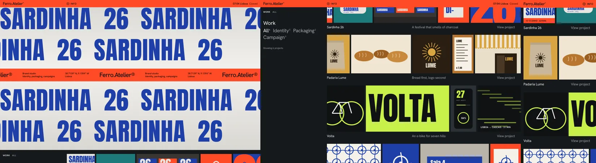

# Justified Project Strips

Most studio sites show work as a grid of same-size thumbnails, which crops every picture to the same shape and turns a project into a single image. A justified strip keeps every image at its own proportion and gives each project a whole row: a poster, a pack shot, a sign, a detail, side by side at one height. The row reads as a sequence, and the edge bleed (the first and last image cut off by the page edge) says "there is more", like a contact sheet held up to the light.

Reference pattern: brand and design studio indexes (Barcelona, Lisbon, Amsterdam) with a thin solid accent bar on top, a sticky "Work / All / Filter" column on the left, and stacked project rows with the name, the idea and "View project" on one caption line.

Use this skill when the brief says: "portfolio", "work index", "case studies", "studio", "show the whole project, not one thumbnail", or the client has 3 to 6 images per project in mixed formats. Do not use it for a single hero project (use a full case-study layout), for products that need equal-weight comparison (use a grid), or when projects only have one image each.

---

## 1. The Rules That Make It Look Expensive

1. **Every image keeps its proportion.** No cropping inside the row. Each `<figure>` gets `--ar` (width / height) and the row works out the height.
2. **One height per row, rows may differ.** Row height is `row width / sum of aspect ratios`. A row of posters is taller than a row of panoramas, and that variety is the rhythm of the page.
3. **Keep each row's ratio sum between about 3.5 and 6.** Below 3.5 the row becomes a wall taller than the screen; above 6 it shrinks to a sliver. Choose and order the images per project so the sum lands in range (here 4.2 to 5.5). This is the "minimum height" rule, enforced by curation rather than code: a code clamp would have to crop.
4. **Bleed both edges, not one.** The track is 6% wider than the row on each side and clipped, so the first and last image are cut by the edges of the column. On the right the row runs to the viewport edge; on the left it is cut by the sticky column. Never let the bleed widen the page.
5. **One small gap.** 8px between images, the same in every row. Thirty pixels between rows, caption included.
6. **The caption is a line, not a card.** Name left in white, the idea in the middle in gray, "View project" right in gray, all 18px. The arrow appears only on hover or focus.
7. **Gray carries hierarchy.** Secondary text is the same size as the name, in a gray that passes (#A3A6A8 on #15191C, 7.2:1).
8. **The accent is a surface, not a highlight.** One loud orange used as the status bar, the info panel and the hero band, always with near-black text. Nowhere else.
9. **The chrome is honest.** The bar shows real things: the studio name, an info toggle, the studio's local time and whether it is open right now.
10. **Filtering moves rows, never crops them.** Hidden rows leave; the rest slide up through a View Transition. The filter count and breadcrumb update with it.
11. **Motion is a slow drift.** Each strip slides through its own bleed as it crosses the viewport, alternating direction row by row, tied to scroll, never on a timer.

---

## 2. Layout Blueprint (1440 wide)

```
┌ ferro.atelier®           ⊕ INFO                                          07:02 Lisboa  Closed ┐ ← solid accent bar, 40px
│ SARDINHA 26 SARDINHA 26 SARDINHA 2…                                                            │
│ …INHA 26 SARDINHA 26                                                                           │ ← poster wall, 92svh
│████ Ferro.Atelier®   Brand studio / Identity…   38.7139° N …   Ferro.Atelier® ███ (marquee) ██│ ← band, in the flow between rows
│ SARDINHA 26 SARDINHA 26 …                                                                      │
└────────────────────────────────────────────────────────────────────────────────────────────────┘
 WORK  ALL                      ▐img▌▐ img  ▌▐   img    ▌▐img▌▐  img  ▐→ (runs off the edge)
                                Sardinha 26        A festival that smells…         View project
 Work                           ▐ img ▌▐    img     ▌▐ img ▌▐img▌▐ img ▐→
 All⁶ Identity⁵ Packaging²      Padaria Lume       Bread first, logo second        View project
 Campaign³                      …
 Showing 6 projects             (sticky column, 25%)          (rows, minmax(0, 1fr))
```

Phones (< 760px): one column. The work column sits above the rows. Each strip becomes a horizontal swipe band (`scroll-snap`, images at 58vw height), the caption drops the middle idea, and the clock hides.

---

## 3. Stack

- CSS only for the layout: flexbox with `flex: var(--ar) 1 0` and `aspect-ratio: var(--ar)`, `overflow: clip`, `animation-timeline: view()` for the drift, `scroll-snap` on phones.
- About 40 lines of JS for the filter (`document.startViewTransition`), the info panel and the clock. Without JS every row, image and link is there; only the filter and clock do nothing.
- Fonts: a neutral grotesk for everything (Hanken Grotesk here; Inter Tight, Geist or a commercial PP Neue Montreal style face work) and one condensed display face for the poster art only (Anton).
- Images: inline SVG in the demo; real work as AVIF/WebP `` with `width`/`height` set from the same aspect ratio.

---

## 4. The Markup

One row. `--ar` is the image's width divided by its height; with ``, use its intrinsic ratio.

```html
<article class="row" data-tags="identity packaging" style="view-transition-name: row-1">
  <div class="strip" tabindex="0" role="group" aria-label="Padaria Lume, 5 images">
    <div class="strip__track">
      <figure class="shot" style="--ar:0.78"></figure>
      <figure class="shot" style="--ar:1.6"></figure>
      <!-- 2 to 4 more -->
    </div>
  </div>
  <div class="cap"><h3>Padaria Lume</h3><p>Bread first, logo second</p><a href="/work/padaria-lume">View project</a></div>
</article>
```

The strip is focusable (`tabindex="0"`) because on phones it is a scroll container: keyboard users swipe it with the arrow keys. Give every row its own `view-transition-name`.

---

## 5. The System (complete CSS from the demo)

```css
:root {
  --bg: #15191C;
  --fg: #F2F2F0;
  --gray: #A3A6A8;          /* 7.2:1 on --bg */
  --accent: #FF4A26;
  --on-accent: #120D0B;     /* 5.8:1 on --accent */
  --on-accent-dim: #4A1205; /* 4.5:1 on --accent */
  --sans: 'Hanken Grotesk', 'Helvetica Neue', Arial, sans-serif;
  --display: Anton, Impact, 'Arial Narrow', sans-serif;
  --bar: 40px;
  --m: clamp(14px, 1.1vw, 18px);  /* page margin */
  --gap: 8px;                      /* gap between images in a strip */
  --aside: 25%;                    /* sticky work column */
}
*, *::before, *::after { box-sizing: border-box; }
html, body { background: var(--bg); color: var(--fg); }
html { -webkit-text-size-adjust: 100%; scroll-padding-top: calc(var(--bar) + 10px); }
body { margin: 0; font: 400 16px/1.35 var(--sans); -webkit-font-smoothing: antialiased; }
a { color: inherit; text-decoration: none; }
svg { display: block; }
:focus-visible { outline: 2px solid var(--accent); outline-offset: 3px; }
.skip { position: fixed; left: var(--m); top: -80px; z-index: 90; padding: 8px 12px; background: var(--fg); color: var(--bg); }
.skip:focus { top: calc(var(--bar) + 8px); }

/* ---------- Bar: solid orange, so text never scrolls under unbacked chrome ---------- */
.bar {
  position: fixed; inset: 0 0 auto; z-index: 50; height: var(--bar);
  display: grid; grid-template-columns: var(--aside) 1fr auto; align-items: center; padding: 0 var(--m);
  background: var(--accent); color: var(--on-accent); font-size: 14px;
}
.bar__brand { font-size: 21px; font-weight: 500; letter-spacing: -.03em; }
.bar__brand sup { font-size: .45em; }
.bar__info { justify-self: start; appearance: none; border: 0; background: none; color: inherit; font: 600 13px var(--sans); letter-spacing: .06em; text-transform: uppercase; display: inline-flex; gap: 8px; align-items: center; cursor: pointer; padding: 6px 0; }
.bar__info svg { width: 15px; height: 15px; transition: rotate .3s; }
.bar__info[aria-expanded="true"] svg { rotate: 45deg; }
.bar__clock { font-weight: 600; font-variant-numeric: tabular-nums; letter-spacing: .02em; }
.bar__clock span { color: var(--on-accent-dim); margin-left: 8px; font-weight: 500; }
.info { position: fixed; top: var(--bar); left: 0; right: 0; z-index: 49; display: grid; grid-template-columns: var(--aside) minmax(0, 1fr) minmax(0, 1fr); gap: 24px 0; padding: 28px var(--m) 36px; background: var(--accent); color: var(--on-accent); }
.info[hidden] { display: none; }
.info p { margin: 0; font-size: clamp(20px, 1.8vw, 28px); line-height: 1.15; letter-spacing: -.02em; max-width: 24em; grid-column: 2; padding-right: 32px; }
.info ul { margin: 0; padding: 0; list-style: none; font-size: 15px; display: grid; gap: 4px; align-content: start; }

/* ---------- Hero: a poster wall crossed by the studio band ---------- */
.hero { position: relative; height: 92svh; min-height: 520px; overflow: hidden; background: linear-gradient(#D9D7D2, #F1F0EC 45%, #D9D7D2); display: flex; flex-direction: column; justify-content: space-evenly; }
/* The band sits in the flow between whole wall rows, so it never slices letters in half. */
.hero__wall { display: contents; }
.hero__wall span:nth-child(n+3) { order: 2; }
.hero__wall span:nth-child(n+5) { display: none; }
.hero__wall span { display: block; white-space: nowrap; font: 400 clamp(72px, 9.5vw, 150px)/1 var(--display); color: #1E3FA8; letter-spacing: .01em; text-transform: uppercase; }
.hero__wall span:nth-child(even) { margin-left: -18vw; }
.band { order: 1; background: var(--accent); color: var(--on-accent); overflow: hidden; }
.band__track { display: flex; width: max-content; animation: band 38s linear infinite; }
.band span { display: flex; align-items: center; gap: clamp(28px, 4vw, 64px); padding: 12px clamp(28px, 4vw, 64px) 12px 0; white-space: nowrap; }
.band b { font-size: clamp(24px, 2.4vw, 34px); font-weight: 500; letter-spacing: -.035em; }
.band i { font-style: normal; font-size: 13px; line-height: 1.25; font-weight: 500; }
@keyframes band { to { transform: translateX(-50%); } }

/* ---------- Work: sticky column + justified strips ---------- */
.work { display: grid; grid-template-columns: var(--aside) minmax(0, 1fr); overflow-x: clip; padding: 22px var(--m) 120px; }
.aside { position: sticky; top: calc(var(--bar) + 18px); align-self: start; display: grid; gap: 34px; padding-right: 24px; }
.crumb { margin: 0; font-size: 12px; font-weight: 600; letter-spacing: .08em; text-transform: uppercase; }
.crumb span { color: var(--gray); margin-left: 12px; }
.aside h2 { margin: 0 0 6px; font-size: clamp(24px, 2vw, 30px); font-weight: 400; letter-spacing: -.02em; }
.filters { display: flex; flex-wrap: wrap; gap: 4px 16px; }
.chip { appearance: none; border: 0; background: none; padding: 0; color: var(--gray); font: 400 clamp(22px, 1.9vw, 29px)/1.2 var(--sans); letter-spacing: -.02em; cursor: pointer; }
.chip[aria-pressed="true"] { color: var(--fg); }
.chip:hover { color: var(--fg); }
.chip sup { font-size: .42em; margin-left: 2px; vertical-align: .9em; }
.count { margin: 0; font-size: 13px; color: var(--gray); }

.rows { display: grid; grid-template-columns: minmax(0, 1fr); gap: 30px; }
.row[hidden] { display: none; }
/* The strip: every image is as wide as its aspect ratio says, so one shared height fills the row exactly.
   The track is wider than the row by --bleed on each side and clipped, so the outer images run off the edges. */
.strip { --bleed: 6%; overflow: hidden; overflow: clip; margin-right: calc(-1 * var(--m)); }
.strip__track { display: flex; gap: var(--gap); width: calc(100% + 2 * var(--bleed)); margin-left: calc(-1 * var(--bleed)); }
.shot { flex: var(--ar) 1 0; min-width: 0; aspect-ratio: var(--ar); margin: 0; overflow: hidden; background: #22282C; }
.shot svg { width: 100%; height: 100%; }
.cap { display: grid; grid-template-columns: 1fr 1fr auto; gap: 16px; align-items: baseline; padding-top: 12px; }
.cap h3 { margin: 0; font-size: 18px; font-weight: 400; letter-spacing: -.01em; }
.cap p { margin: 0; font-size: 18px; color: var(--gray); letter-spacing: -.01em; }
.cap a { font-size: 18px; color: var(--gray); letter-spacing: -.01em; }
.cap a::after { content: ' →'; display: inline-block; opacity: 0; translate: -6px 0; transition: opacity .25s, translate .25s; }
.row:hover .cap a, .cap a:focus-visible { color: var(--fg); }
.row:hover .cap a::after, .cap a:focus-visible::after { opacity: 1; translate: 0 0; }

/* Scroll-linked drift: each strip slides through its bleed while it crosses the viewport, rows alternate */
@supports (animation-timeline: view()) {
  @media (prefers-reduced-motion: no-preference) and (min-width: 761px) {
    .strip__track { animation: drift linear both; animation-timeline: view(); animation-range: cover 0% cover 100%; }
    .row:nth-child(even) .strip__track { animation-direction: reverse; }
    @keyframes drift { from { translate: var(--bleed) 0; } to { translate: calc(-1 * var(--bleed)) 0; } }
  }
}

/* ---------- About + footer ---------- */
.about { display: grid; grid-template-columns: var(--aside) 1fr; padding: 40px var(--m) 140px; border-top: 1px solid #2C3236; }
.about p { grid-column: 2; margin: 0; max-width: 22em; font-size: clamp(26px, 2.6vw, 40px); line-height: 1.12; letter-spacing: -.035em; }
.about p span { color: var(--gray); }
.foot { display: grid; grid-template-columns: var(--aside) 1fr 1fr auto; gap: 24px; padding: 22px var(--m) 30px; border-top: 1px solid #2C3236; font-size: 14px; color: var(--gray); }
.foot a:hover { color: var(--fg); }
.foot ul { margin: 0; padding: 0; list-style: none; display: grid; gap: 3px; }
.foot strong { color: var(--fg); font-weight: 500; }

/* ---------- Phones: the strip becomes a swipe band ---------- */
@media (max-width: 760px) {
  :root { --aside: auto; }
  .bar { grid-template-columns: 1fr auto; }
  .bar__clock { display: none; }
  .hero { height: 80svh; min-height: 480px; }
  .hero__wall span { font-size: 25vw; line-height: .95; }
  .info { grid-template-columns: 1fr; }
  .info p { grid-column: 1; }
  .work, .about { grid-template-columns: minmax(0, 1fr); }
  .aside { position: static; padding: 0 0 26px; gap: 20px; }
  /* The focusable .strip is the scroller, so arrow keys swipe it too. */
  .strip { overflow-x: auto; overscroll-behavior-x: contain; scroll-snap-type: x mandatory; scrollbar-width: none; }
  .strip::-webkit-scrollbar { display: none; }
  .strip__track { width: max-content; margin-left: 0; padding-right: var(--m); }
  .shot { flex: none; height: 58vw; width: auto; scroll-snap-align: start; }
  .cap { grid-template-columns: 1fr auto; }
  .cap p { display: none; }
  .about p { grid-column: 1; }
  .foot { grid-template-columns: 1fr 1fr; }
  .foot > :first-child { grid-column: 1 / -1; }
}

@media (prefers-reduced-motion: reduce) {
  .band__track { animation: none; }
  .cap a::after, .bar__info svg { transition: none; }
  ::view-transition-group(*), ::view-transition-old(*), ::view-transition-new(*) { animation: none !important; }
}
::view-transition-old(*), ::view-transition-new(*) { animation-duration: .35s; }
```

---

## 6. Behavior (complete JS from the demo)

```js
// Filter: chips are toggle buttons; rows reflow through a view transition where the browser has one.
(function () {
  var chips = [].slice.call(document.querySelectorAll('[data-filter]'));
  var rows = [].slice.call(document.querySelectorAll('.row'));
  var count = document.querySelector('[data-count]');
  var crumb = document.querySelector('[data-crumb]');
  var reduce = matchMedia('(prefers-reduced-motion: reduce)').matches;
  function apply(f) {
    var shown = 0;
    rows.forEach(function (r) { var on = f === 'all' || r.dataset.tags.split(' ').indexOf(f) > -1; r.hidden = !on; if (on) shown++; });
    chips.forEach(function (c) { c.setAttribute('aria-pressed', String(c.dataset.filter === f)); });
    chips.forEach(function (c) { if (c.dataset.filter === f) crumb.textContent = c.firstChild.textContent; });
    count.textContent = 'Showing ' + shown + (shown === 1 ? ' project' : ' projects');
  }
  chips.forEach(function (c) {
    c.addEventListener('click', function () {
      var f = c.dataset.filter;
      if (document.startViewTransition && !reduce) document.startViewTransition(function () { apply(f); });
      else apply(f);
    });
  });
})();

// Info panel under the bar; Escape closes it.
(function () {
  var btn = document.querySelector('.bar__info'), panel = document.getElementById('info');
  function set(open) { panel.hidden = !open; btn.setAttribute('aria-expanded', String(open)); }
  btn.addEventListener('click', function () { set(panel.hidden); });
  document.addEventListener('keydown', function (e) { if (e.key === 'Escape' && !panel.hidden) { set(false); btn.focus(); } });
})();

// Clock: Lisbon time, minutes only, plus whether the studio is open right now.
(function () {
  var el = document.querySelector('[data-clock]'), st = document.querySelector('[data-status]');
  var fmt = new Intl.DateTimeFormat('en-GB', { hour: '2-digit', minute: '2-digit', timeZone: 'Europe/Lisbon' });
  var day = new Intl.DateTimeFormat('en-GB', { weekday: 'short', timeZone: 'Europe/Lisbon' });
  function tick() {
    var now = new Date(), hm = fmt.format(now), h = +hm.slice(0, 2), d = day.format(now);
    el.textContent = hm;
    st.textContent = (d !== 'Sat' && d !== 'Sun' && h >= 9 && h < 19) ? 'Open' : 'Closed';
  }
  tick(); setInterval(tick, 15000);
})();
```

---

## 7. Why Each Part Is Built This Way

- **`flex: var(--ar) 1 0` plus `aspect-ratio: var(--ar)`.** With a zero basis, free space is shared in proportion to each image's aspect ratio, so every image gets `width = ar × h` for the same `h`, and `aspect-ratio` turns that width back into the shared height. No JS measuring, no resize listener, and it reflows for free when the column changes width.
- **`min-width: 0` on `.shot`.** A flex item's default minimum is its content size; an `` or SVG with a large intrinsic width would refuse to shrink and push the row out.
- **The bleed is a wider track inside a clipped strip.** `width: calc(100% + 2 * var(--bleed)); margin-left: calc(-1 * var(--bleed))` keeps the math in one place. `overflow: clip` (with `hidden` before it for old Safari) cuts the overflow without creating a scroll container, so the drift animation and sticky column still behave.
- **`minmax(0, 1fr)` on every grid track that holds a strip.** On phones the track is `max-content` wide; with plain `1fr` the grid column grew to 1,299px and the phone rendered the page zoomed out. `overflow-x: clip` on `.work` is a second fence.
- **The right edge runs to the viewport.** `margin-right: calc(-1 * var(--m))` on the strip. Without it the "bleed" stopped at the page margin and looked like a crop error instead of film.
- **`animation-timeline: view()` for the drift,** inside `@supports` and `prefers-reduced-motion: no-preference`, desktop only. It translates the track from `+bleed` to `-bleed` while the row crosses the viewport, so the hidden 6% on each side is revealed in turn. No scroll listener.
- **On phones the focusable `.strip` is the scroller,** not its inner track. If the track scrolls, a keyboard user focuses the strip and the arrow keys do nothing.
- **The hero band is in the flow.** As an absolutely centered overlay it sliced a wall row in half and left letter stumps above and below. Ordering it between whole rows (`display: contents` on the wall, `order` on the spans) keeps every letter whole.
- **A solid bar, not a transparent one.** Work images pass under it all the way down the page; an unbacked bar would put text over pictures.

---

## 8. Fallbacks and Accessibility

- **No JS:** all rows, captions and links render; the filter chips stay on "All", the clock shows `--:--`.
- **No `animation-timeline`:** strips sit still at their centered bleed. Nothing is hidden: the outer images are cut by the same 6% as with motion.
- **No View Transitions or reduced motion:** the filter applies instantly. Reduced motion also stops the band marquee and the arrow slide.
- **Contrast:** text #F2F2F0 on #15191C 15.8:1; gray #A3A6A8 7.2:1; near-black #120D0B on the orange #FF4A26 5.8:1; the dim status word #4A1205 on orange 4.5:1.
- **Semantics:** filter chips are `<button aria-pressed>`, the count is `aria-live="polite"`, the info toggle has `aria-expanded` and `aria-controls` and closes on Escape, every image has a description, each strip is a labelled group ("Padaria Lume, 5 images").
- **Focus:** a 2px accent outline on everything, including the strips and the caption link (which also shows its arrow on focus).

---

## 9. Performance Checklist

- [ ] Row layout is pure CSS: no measuring, no resize observers.
- [ ] Real images: `loading="lazy"` from the second row, `width`/`height` attributes from the aspect ratio so nothing shifts, `sizes` close to `(min-width: 760px) 20vw, 70vw`.
- [ ] One marquee animated with `transform` only; the drift runs on the compositor through a scroll timeline.
- [ ] The clock ticks every 15 seconds and only writes two text nodes.
- [ ] Two font families (one only for the poster art); `display=swap`.

---

## 10. Anti-Patterns (Instant Slop)

- Square thumbnails with `object-fit: cover`: every pack shot loses its top and every poster its title.
- A masonry wall with ragged row ends, or a JS justified-gallery library for what four CSS properties do.
- Bleed on one side only, or a bleed that adds a horizontal scrollbar to the page.
- A row of eight panoramas that ends up 90px tall. Curate to the ratio range.
- Captions on cards with backgrounds and radius, or overlaid on the images.
- Filter tabs that fade rows out and leave holes.
- A translucent blurred top bar over the work.
- Different gaps in every row, or a gap larger than 12px.

---

## 11. Working Demo

[`demo/index.html`](demo/index.html) is a complete page for an invented Lisbon brand studio, Ferro Atelier: an orange status bar with a live Lisbon clock and open/closed status, an info panel, a poster-wall hero crossed by a marquee band, a sticky work column with Identity, Packaging and Campaign filters, six project strips with original SVG artwork (a sardine festival, a bakery, an e-bike, a tile museum, an olive oil, a record label), an about statement and a footer.

Verified with `node scripts/verify-demo.mjs skills/justified-strip-skill/demo` (desktop, phones at 360/390/430, reduced motion, forced fallback, focus visibility, host body reset, fixed chrome), plus the filter, the info panel and keyboard swiping on a phone checked by hand.



Lessons learned while building it (already folded into the rules above):

- On phones the page rendered at 1,299px wide: the swipe band's `max-content` track widened a plain `1fr` grid column. `minmax(0, 1fr)` on the tracks and `overflow-x: clip` on `.work` fixed it.
- The marquee band was centered over the poster wall and cut one row of letters in half. It now sits in the flow between whole rows.
- The bleed ended at the page margin, so the cut images looked like a mistake. The strip now runs to the viewport edge on the right.
- On phones the poster wall was four small rows floating in empty space. The wall type is 25vw there and the hero 80svh.
- The breadcrumb still said "All" after choosing Packaging. It now follows the active filter.
- The info panel text started 24px right of the Info button above it. The panel uses the bar's columns with no column gap.
- Arrow keys did nothing on a focused phone strip because the inner track was the scroller. The focusable strip is the scroller now.

---

## 12. Pre-Flight

1. Is every image at its own proportion, with no cropping inside the row?
2. Does every row end exactly on both edges at 1440, 1024 and 761px?
3. Is each row's aspect-ratio sum between about 3.5 and 6?
4. Does the page stay exactly the viewport width on a 360px phone?
5. Does filtering update the chips, the count and the breadcrumb, and does it work without motion?
6. Can a keyboard user reach each strip and swipe it with the arrow keys on a phone?
