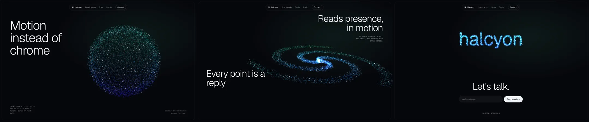

# Particle Morph Hero

One particle system, several shapes, scroll is the timeline. The page feels alive because the *same* points rearrange themselves into each section's idea instead of swapping images or videos.

Reference pattern: dark SaaS / AI landing pages where a mint-to-violet point cloud breathes as an orb, opens into a spiral galaxy, then gathers into an organic form (a brain, a hand, a product silhouette, the wordmark) while thin, quiet typography sits around it.

Use this skill when the brief says: "immersive", "living interface", "WebGL hero", "particles", "AI product", "feels alive", "Three.js", or points at a reference like this. Do not use it for content-heavy sites, dashboards, or anything that must run well on low-end Android as the primary audience (ship the 2D still there).

---

## 1. The Rules That Make It Look Expensive

1. **One system, many targets.** Never fade one canvas out and another in. Every shape is a target position for the same N particles. The morph *is* the transition.
2. **Hold the shape where people read.** Each section has an anchor (its vertical center). Around the anchor the cloud sits exactly on that section's shape; the morph only runs in the middle 40 percent of the scroll between two anchors (`smoothstep(raw, 0.3, 0.7)`). A half-morphed cloud behind a headline reads as noise.
3. **The canvas is the art, the chrome is quiet.** Headline is light weight (300), `clamp(44px, 6.4vw, 96px)`, line-height 1.0, letter-spacing -0.035em, max three lines. All other text is 11px uppercase mono meta copy (letter-spacing 0.06em, 56 percent ink) parked in corners. One CTA.
4. **Two hues, one ramp.** Mint `#5EF2C2` to violet `#6B5CFF`. Color by a per-particle value (height plus radius), never random per point. About 2.5 percent of points are near-white "hot" points so the form has a light source.
5. **Additive blending on near-black, not pure black.** Background `#06070B` with one soft radial glow (`rgba(94,242,194,0.08)`) behind the form. Pure `#000` makes additive points look cheap.
6. **Breathing, not spinning.** Idle motion is hashed noise on every particle (amplitude 0.025 world units, about 2 percent of the orb) plus yaw at 0.04 rad/s. Fast rotation reads as a 2012 screensaver.
7. **Stagger the morph.** Each particle starts its move at `aRandom * 0.4` of the way through and takes 0.6 to arrive, so the shape dissolves and re-forms like a flock.
8. **Pointer is a force, not a cursor.** Points within 0.9 world units of the pointer get pushed 0.35 units out along the view plane and spring back (force eases at `dt * 4`).
9. **Every statement over the cloud gets a scrim.** A radial gradient behind the text block (`rgba(6,7,11,0.86)` at the core, transparent at the edge, 14 to 18 percent bigger than the block). Never a solid box.
10. **Contrast the dark hero with a light section.** An off-white editorial block (`#F3F2EE`, ink `#121317`) with numbered columns `[01] [02]` and a figure plate: the same orb drawn as a 2D still on a dark card, with a mono caption. The light break makes the dark sections feel deep, and the plate shows the system at rest. The fixed glass nav flips to a light variant while it sits over this section.
11. **Fit by shape, not by screen.** On wide screens the form sits 0.9 world units right of center (the open space beside the headline) and drifts to 0.54 for the galaxy, which is twice as wide. On narrow screens the orb scales to `aspect * 1.1` and the galaxy and wordmark to `aspect * 0.8`, so nothing clips at 360px.
12. **Honor the budget out loud.** Points and pixel ratio step down by device tier, and the stats row prints the tier this device actually got. Reduced motion snaps between shapes and freezes the cloud. Without WebGL a 2D still of the orb takes its place.

---

## 2. Layout Blueprint

```
┌──────────────────────────────────────────────────────────┐
│        ✳ Halcyon  How it works  Scale  Studio [Contact]  │  glass pill nav, flips light over paper
│  Motion                                                  │  h1 300, clamp(44px, 6.4vw, 96px)
│  instead of            ░░▒▒▓▓ orb ▓▓▒▒░░                 │  form 0.9 units right of center
│  chrome                                                  │
│  POINT COUNTS STEP DOWN          REDUCED MOTION HONORED  │  11px mono meta, bottom corners
└──────────────────────────────────────────────────────────┘
  #how      galaxy, statement bottom right (top right on phones) inside a scrim
  #scale    galaxy, statement directly above the stats row, never at the section top
  .paper    off-white, 24px radius, h2 + [01] [02] columns + figure plate (2D orb still)
  #contact  wordmark centered and lifted 0.75 units, "Let's talk." + email + one button
```

- The page sits in a fixed hairline frame (`inset: 12px`, `border-radius: 24px`, `rgba(255,255,255,0.08)`): it reads like a product window, not a full-bleed demo.
- Sections are `min-height: 100vh` grids with rows `auto 1fr auto`, so statements sit at the top or bottom edge and the form owns the middle.
- Two statements must never share a screen. If one section ends with text at its bottom, the next one starts with empty space at its top (`.proof` puts its headline in the last rows, beside the stats).
- On phones the form is centered, so a statement parks above it at the reading stop (`grid-row: 1`), not across it.

Key CSS (from the demo):

```css
#gl { position: fixed; inset: 0; width: 100vw; height: 100vh; display: block; pointer-events: none; }
.fallback { position: fixed; inset: 0; background: radial-gradient(40% 40% at 60% 50%, rgba(107, 92, 255, 0.35), transparent 70%), radial-gradient(30% 30% at 55% 45%, rgba(94, 242, 194, 0.25), transparent 70%); display: none; }
.no-webgl .fallback { display: block; }
#still { position: fixed; inset: 0; width: 100vw; height: 100vh; display: none; pointer-events: none; }
.no-webgl #still { display: block; transition: opacity 0.6s ease; }
.no-webgl.at-contact #still { opacity: 0.22; }
.no-webgl #gl { display: none; }
/* over the light section the dark glass turns into a grey smear: flip it */
nav.on-paper { background: rgba(243, 242, 238, 0.9); border-color: rgba(18, 19, 23, 0.1); color: var(--paper-ink); }
nav.on-paper .links { color: rgba(18, 19, 23, 0.6); }
nav.on-paper a:hover, nav.on-paper .cta { color: var(--paper-ink); }
nav.on-paper .cta { border-color: rgba(18, 19, 23, 0.2); }
nav.on-paper .cta:hover { background: var(--paper-ink); color: var(--paper); }
nav.on-paper a:focus-visible { outline-color: var(--violet); }
.scene.proof { grid-template-rows: 1fr auto auto; }
.scene.proof h2 { max-width: 12ch; margin-bottom: 40px; }
[data-statement] { opacity: 0; transform: translateY(24px); filter: blur(8px); transition: opacity 0.9s ease, transform 0.9s cubic-bezier(0.2, 0.7, 0.1, 1), filter 0.9s ease; }
[data-statement].in { opacity: 1; transform: none; filter: none; }
.scrim { position: relative; }
.scrim::before { content: ''; position: absolute; inset: -18% -14%; z-index: -1; pointer-events: none; background: radial-gradient(closest-side, rgba(6, 7, 11, 0.86), rgba(6, 7, 11, 0.6) 55%, transparent); }
.stats::before { content: ''; position: absolute; inset: -40px 0 -56px; z-index: -1; background: linear-gradient(to top, rgba(6, 7, 11, 0.92) 40%, transparent); pointer-events: none; }
.plate { margin: 0; }
.plate .art { aspect-ratio: 4 / 5; border-radius: 16px; overflow: hidden; background: radial-gradient(60% 50% at 50% 48%, #141633, #06070b 75%); }
.plate canvas { display: block; width: 100%; height: 100%; }
.plate figcaption { display: flex; justify-content: space-between; gap: 16px; margin-top: 14px; font-family: 'Geist Mono', monospace; font-size: 11px; letter-spacing: 0.06em; text-transform: uppercase; color: #4a4c55; }
@media (prefers-reduced-motion: reduce) {
  [data-statement] { opacity: 1; transform: none; filter: none; transition: none; }
}
@media (max-width: 720px) {
  /* the form is centered on phones: park the statement above it, not across it */
  #how .right { grid-row: 1; }
}
```

---

## 3. Stack

- `three` 0.160.0 via import map from jsDelivr, a custom `ShaderMaterial` on one `THREE.Points`.
- A plain scroll read inside the render loop drives one `uProgress` uniform (eased at `dt * 3`). No scroll library needed; if the project already uses GSAP, a `ScrollTrigger` with `scrub` can feed the same `goal`, but keep the hold (rule 2) and never run both.
- `MeshSurfaceSampler` from `three/examples/jsm/math/MeshSurfaceSampler.js` to turn any GLB (brain, hand, logo) into points.
- Next.js / React: mount the canvas in a client component, `dynamic(() => import(...), { ssr: false })`, and dispose geometry, material, renderer and listeners on unmount.

---

## 4. Device Tier and Shape Targets

Every generator returns a `Float32Array` of length `count * 3`, centered at the origin. All targets share the same `count`.

```js
// ---------- device tier ----------
function deviceTier() {
  const cores = navigator.hardwareConcurrency || 4;
  const mem = navigator.deviceMemory || 4;
  const small = Math.min(screen.width, screen.height) < 700;
  if (small || cores <= 4 || mem <= 2) return { count: 18000, maxDpr: 1.5, pointSize: 22 };
  if (cores <= 8) return { count: 45000, maxDpr: 1.75, pointSize: 20 };
  return { count: 80000, maxDpr: 2, pointSize: 18 };
}

// ---------- shape targets ----------
function orb(count, radius = 1.2) {
  const out = new Float32Array(count * 3);
  const golden = Math.PI * (3 - Math.sqrt(5));
  for (let i = 0; i < count; i++) {
    const y = 1 - (i / (count - 1)) * 2;
    const r = Math.sqrt(1 - y * y);
    const theta = golden * i;
    const shell = radius * (0.92 + Math.random() * 0.16);
    out[i * 3] = Math.cos(theta) * r * shell;
    out[i * 3 + 1] = y * shell;
    out[i * 3 + 2] = Math.sin(theta) * r * shell;
  }
  return out;
}

function galaxy(count, { arms = 3, radius = 2.4, twist = 2.2, tilt = 0.32 } = {}) {
  const out = new Float32Array(count * 3);
  const cos = Math.cos(tilt), sin = Math.sin(tilt);
  for (let i = 0; i < count; i++) {
    const t = Math.pow(Math.random(), 1.6);
    const r = t * radius;
    const angle = (i % arms) / arms * Math.PI * 2 + r * twist;
    const spread = 0.35 * (1 - t * 0.6);
    const y = (Math.random() - 0.5) * 0.12 * (1 - t);
    const z = Math.sin(angle) * r + (Math.random() - 0.5) * spread * r;
    out[i * 3] = Math.cos(angle) * r + (Math.random() - 0.5) * spread * r;
    out[i * 3 + 1] = y * cos - z * sin;
    out[i * 3 + 2] = y * sin + z * cos;
  }
  return out;
}

// Sample a word from a 2D canvas: the brand becomes the last shape.
function textPoints(count, word, { width = 4.2, depth = 0.25, font = '300 220px Geist, system-ui, sans-serif' } = {}) {
  const c = document.createElement('canvas');
  c.width = 1400; c.height = 360;
  const ctx = c.getContext('2d');
  ctx.fillStyle = '#fff'; ctx.font = font; ctx.textAlign = 'center'; ctx.textBaseline = 'middle';
  ctx.fillText(word, c.width / 2, c.height / 2);
  const data = ctx.getImageData(0, 0, c.width, c.height).data;
  const filled = [];
  for (let y = 0; y < c.height; y += 2) for (let x = 0; x < c.width; x += 2) if (data[(y * c.width + x) * 4 + 3] > 128) filled.push(x, y);
  const out = new Float32Array(count * 3);
  const scale = width / c.width;
  const n = filled.length / 2;
  for (let i = 0; i < count; i++) {
    const k = (Math.random() * n | 0) * 2;
    out[i * 3] = (filled[k] - c.width / 2 + Math.random() * 2) * scale;
    out[i * 3 + 1] = -(filled[k + 1] - c.height / 2 + Math.random() * 2) * scale;
    out[i * 3 + 2] = (Math.random() - 0.5) * depth;
  }
  return out;
}
```

Wait for `document.fonts.ready` before sampling text, or the fallback font gets baked into the shape.

Any mesh works as a target too (not used in the demo, same contract):

```js
import { MeshSurfaceSampler } from 'three/examples/jsm/math/MeshSurfaceSampler.js';

function fromMesh(mesh, count, size = 2.4) {
  const geo = mesh.geometry.clone().applyMatrix4(mesh.matrixWorld);
  geo.computeBoundingBox();
  const center = geo.boundingBox.getCenter(new THREE.Vector3());
  const scale = size / Math.max(...geo.boundingBox.getSize(new THREE.Vector3()).toArray());
  const sampler = new MeshSurfaceSampler(new THREE.Mesh(geo)).build();
  const p = new THREE.Vector3();
  const out = new Float32Array(count * 3);
  for (let i = 0; i < count; i++) {
    sampler.sample(p);
    p.sub(center).multiplyScalar(scale);
    out.set([p.x, p.y, p.z], i * 3);
  }
  return out;
}
```

Model sourcing: a CC0 or properly licensed GLB, decimated under 50k triangles. Bake targets to a `.bin` if sampling shows up in the startup profile.

---

## 5. The Shader

Targets live in attributes. `uProgress` runs from `0` to `2` for three shapes; each particle computes its own staggered blend.

```js
// ---------- shaders ----------
const vertexShader = /* glsl */ `
  uniform float uTime;
  uniform float uProgress;
  uniform float uSize;
  uniform float uPixelRatio;
  uniform vec3  uPointer;
  uniform float uPointerForce;
  attribute vec3 aShape1;
  attribute vec3 aShape2;
  attribute float aRandom;
  varying float vMix;
  varying float vGlow;

  vec3 hash3(vec3 p) {
    p = vec3(dot(p, vec3(127.1, 311.7, 74.7)), dot(p, vec3(269.5, 183.3, 246.1)), dot(p, vec3(113.5, 271.9, 124.6)));
    return fract(sin(p) * 43758.5453) * 2.0 - 1.0;
  }
  float stagger(float local) {
    float d = aRandom * 0.4;
    return smoothstep(d, d + 0.6, local);
  }
  void main() {
    vec3 pos = mix(position, aShape1, stagger(clamp(uProgress, 0.0, 1.0)));
    pos = mix(pos, aShape2, stagger(clamp(uProgress - 1.0, 0.0, 1.0)));

    float tt = uTime * 0.25 + aRandom * 4.0;
    vec3 n = mix(hash3(pos * 1.7 + floor(tt)), hash3(pos * 1.7 + floor(tt) + 1.0), fract(tt));
    pos += n * 0.025;

    vec3 toP = pos - uPointer;
    float push = (1.0 - smoothstep(0.0, 0.9, length(toP.xy))) * uPointerForce;
    pos.xy += normalize(toP.xy + 1e-4) * push * 0.35;

    vec4 mv = modelViewMatrix * vec4(pos, 1.0);
    gl_Position = projectionMatrix * mv;
    gl_PointSize = uSize * uPixelRatio * (0.6 + aRandom * 0.8) / -mv.z;
    vMix = clamp(0.3 + pos.y * 0.3 + length(pos.xz) * 0.2, 0.0, 1.0);
    vGlow = step(0.975, aRandom);
  }
`;
const fragmentShader = /* glsl */ `
  uniform vec3 uColorA;
  uniform vec3 uColorB;
  varying float vMix;
  varying float vGlow;
  void main() {
    float d = length(gl_PointCoord - 0.5);
    if (d > 0.5) discard;
    float alpha = smoothstep(0.5, 0.0, d);
    vec3 col = mix(uColorB, uColorA, vMix);
    col = mix(col, vec3(0.92, 0.98, 1.0), vGlow * 0.8);
    gl_FragColor = vec4(col, alpha * (0.55 + vGlow * 0.45));
  }
`;
```

---

## 6. The 2D Still (Plate and Fallback)

The same orb, projected with the camera's perspective and drawn on a 2D canvas with `lighter` compositing. It fills the editorial plate and replaces the WebGL canvas when WebGL is missing, so the no-WebGL page still shows the brand's form instead of a blurry blob.

```js
// ---------- 2D still: same orb, no WebGL ----------
// Used for the editorial plate and as the fallback when WebGL is missing.
const VIEW_HALF = 7 * Math.tan((35 / 2) * Math.PI / 180); // world units from center to top edge at z = 0
function drawOrbStill(canvas, { count = 6000, radius = 1.2, offsetX = 0, scale = 1, dot = 1.1 } = {}) {
  const dpr = Math.min(devicePixelRatio, 2);
  const w = canvas.clientWidth, h = canvas.clientHeight;
  canvas.width = Math.round(w * dpr); canvas.height = Math.round(h * dpr);
  const ctx = canvas.getContext('2d');
  ctx.setTransform(dpr, 0, 0, dpr, 0, 0);
  ctx.clearRect(0, 0, w, h);
  ctx.globalCompositeOperation = 'lighter';
  const unit = (h / 2) / VIEW_HALF;
  const cx = w / 2 + offsetX * unit, cy = h / 2;
  const pts = orb(count, radius);
  const a = [0x6b, 0x5c, 0xff], b = [0x5e, 0xf2, 0xc2];
  for (let i = 0; i < count; i++) {
    const x = pts[i * 3], y = pts[i * 3 + 1], z = pts[i * 3 + 2];
    const k = 7 / (7 - z); // same perspective as the camera at z = 7
    const m = Math.min(Math.max(0.3 + y * 0.3 + Math.hypot(x, z) * 0.2, 0), 1);
    const hot = Math.random() > 0.975;
    const c = hot ? [235, 250, 255] : a.map((v, j) => Math.round(v + (b[j] - v) * m));
    ctx.fillStyle = `rgba(${c[0]},${c[1]},${c[2]},${hot ? 0.9 : 0.22 + 0.3 * (z + radius) / (2 * radius)})`;
    ctx.beginPath();
    ctx.arc(cx + x * k * unit * scale, cy - y * k * unit * scale, dot * k * (hot ? 1.3 : 1), 0, Math.PI * 2);
    ctx.fill();
  }
}
```

---

## 7. Boot, Scroll Choreography and Render Loop

Sections carry `data-shape` (0 orb, 1 galaxy, 2 wordmark). Progress interpolates between section centers with the hold from rule 2. The wordmark settles face-on, centers, and lifts 0.75 units above the contact copy.

```js
import * as THREE from 'three';

// ---------- boot ----------
function hasWebGL() {
  try { const c = document.createElement('canvas'); return !!(c.getContext('webgl2') || c.getContext('webgl')); } catch { return false; }
}
const reduce = matchMedia('(prefers-reduced-motion: reduce)').matches;
const statements = document.querySelectorAll('[data-statement]');
const io = new IntersectionObserver((es) => es.forEach((e) => e.isIntersecting && e.target.classList.add('in')), { rootMargin: '0px 0px -20% 0px' });
statements.forEach((el) => io.observe(el));

// nav flips to its light variant while the paper section sits under it;
// the fixed canvas is never offscreen, so "covered by paper" is when the render loop rests
const nav = document.querySelector('nav');
const paper = document.querySelector('.paper');
let covered = false;
const navCheck = () => {
  const r = paper.getBoundingClientRect(), n = nav.getBoundingClientRect();
  nav.classList.toggle('on-paper', r.top < n.bottom && r.bottom > n.top);
  covered = r.top <= 0 && r.bottom >= innerHeight;
};
addEventListener('scroll', navCheck, { passive: true });
navCheck();

const plate = document.getElementById('plate');
const drawPlate = () => drawOrbStill(plate, { count: 6000, radius: 1.2, scale: 1.25 });
new ResizeObserver(drawPlate).observe(plate);

// the stat tells the truth about this device
const tier = deviceTier();
document.querySelector('[data-count]').textContent = `${Math.round(tier.count / 1000)}k`;
document.querySelector('[data-count-label]').textContent = 'Points on this device';

// wide screens keep the form in the open space beside the headline
const wide = () => innerWidth / innerHeight > 1.1;

if (!hasWebGL() || navigator.connection?.saveData) {
  document.documentElement.classList.add('no-webgl');
  const still = document.getElementById('still');
  const drawStill = () => drawOrbStill(still, {
    count: 5000, offsetX: wide() ? 0.9 : 0, scale: wide() ? 1 : Math.min(1, (innerWidth / innerHeight) * 1.1),
  });
  addEventListener('resize', drawStill);
  drawStill();
  // no wordmark to lift out of the way, so the still steps back behind the contact copy
  const contact = document.getElementById('contact');
  const dim = () => document.documentElement.classList.toggle('at-contact', contact.getBoundingClientRect().top < innerHeight * 0.6);
  addEventListener('scroll', dim, { passive: true });
  dim();
} else {
  await document.fonts.ready;
  const canvas = document.getElementById('gl');
  const renderer = new THREE.WebGLRenderer({ canvas, antialias: false, alpha: true, powerPreference: 'high-performance' });
  const dpr = Math.min(devicePixelRatio, tier.maxDpr);
  renderer.setPixelRatio(dpr);
  const scene = new THREE.Scene();
  const camera = new THREE.PerspectiveCamera(35, 1, 0.1, 100);
  camera.position.set(0, 0, 7);

  const count = tier.count;
  const geo = new THREE.BufferGeometry();
  geo.setAttribute('position', new THREE.BufferAttribute(orb(count), 3));
  geo.setAttribute('aShape1', new THREE.BufferAttribute(galaxy(count), 3));
  geo.setAttribute('aShape2', new THREE.BufferAttribute(textPoints(count, 'halcyon'), 3));
  const rnd = new Float32Array(count);
  for (let i = 0; i < count; i++) rnd[i] = Math.random();
  geo.setAttribute('aRandom', new THREE.BufferAttribute(rnd, 1));
  geo.boundingSphere = new THREE.Sphere(new THREE.Vector3(), 4);

  const material = new THREE.ShaderMaterial({
    vertexShader, fragmentShader, transparent: true, depthWrite: false, blending: THREE.AdditiveBlending,
    uniforms: {
      uTime: { value: 0 }, uProgress: { value: 0 }, uSize: { value: tier.pointSize }, uPixelRatio: { value: dpr },
      uPointer: { value: new THREE.Vector3(99, 99, 0) }, uPointerForce: { value: 0 },
      uColorA: { value: new THREE.Color('#5EF2C2') }, uColorB: { value: new THREE.Color('#6B5CFF') },
    },
  });
  const points = new THREE.Points(geo, material);
  scene.add(points);

  // keep the form in the open space beside the headline on wide screens, centered on narrow ones
  let wideX = 0, aspect = 1;
  const layout = () => {
    const w = innerWidth, h = innerHeight;
    renderer.setSize(w, h, false);
    camera.aspect = aspect = w / h;
    camera.updateProjectionMatrix();
    wideX = wide() ? 0.9 : 0;
  };
  addEventListener('resize', layout);
  layout();

  const ray = new THREE.Raycaster(), ndc = new THREE.Vector2(), plane = new THREE.Plane(new THREE.Vector3(0, 0, 1), 0);
  let pointerTarget = 0;
  addEventListener('pointermove', (e) => {
    ndc.set((e.clientX / innerWidth) * 2 - 1, -(e.clientY / innerHeight) * 2 + 1);
    ray.setFromCamera(ndc, camera);
    ray.ray.intersectPlane(plane, material.uniforms.uPointer.value);
    material.uniforms.uPointer.value.sub(points.position);
    pointerTarget = reduce ? 0 : 1;
  }, { passive: true });
  document.addEventListener('pointerleave', () => { pointerTarget = 0; });

  // scroll → progress: interpolate between each section's data-shape at its center
  const sections = [...document.querySelectorAll('[data-shape]')];
  const targetProgress = () => {
    const mid = scrollY + innerHeight / 2;
    const anchors = sections.map((s) => ({ y: s.offsetTop + s.offsetHeight / 2, v: parseFloat(s.dataset.shape) }));
    if (mid <= anchors[0].y) return anchors[0].v;
    for (let i = 1; i < anchors.length; i++) {
      if (mid <= anchors[i].y) {
        const raw = (mid - anchors[i - 1].y) / (anchors[i].y - anchors[i - 1].y);
        // hold each shape flat around its anchor; the morph happens between reading stops
        const t = reduce ? (raw < 0.5 ? 0 : 1) : THREE.MathUtils.smoothstep(raw, 0.3, 0.7);
        return anchors[i - 1].v + (anchors[i].v - anchors[i - 1].v) * t;
      }
    }
    return anchors[anchors.length - 1].v;
  };

  const clock = new THREE.Clock();
  const tick = () => {
    requestAnimationFrame(tick);
    if (document.hidden || covered) return;
    const dt = Math.min(clock.getDelta(), 0.05);
    const u = material.uniforms;
    const goal = targetProgress();
    u.uProgress.value = reduce ? goal : u.uProgress.value + (goal - u.uProgress.value) * Math.min(dt * 3, 1);
    if (!reduce) {
      u.uTime.value += dt;
      // spin slowly as orb and galaxy, settle face-on for the wordmark
      const settle = THREE.MathUtils.smoothstep(u.uProgress.value, 1.5, 2.0);
      let ry = points.rotation.y + dt * 0.04 * (1 - settle);
      ry = Math.atan2(Math.sin(ry), Math.cos(ry)); // wrap so settling never unwinds full turns
      points.rotation.y = ry * (1 - settle * Math.min(dt * 3, 1));
    }
    // the wordmark centers and lifts above the contact copy
    const settled = THREE.MathUtils.smoothstep(u.uProgress.value, 1.5, 2.0);
    // the galaxy is twice the orb's width: pull it in from the edge, then center the wordmark
    const x = wideX * (1 - 0.4 * THREE.MathUtils.smoothstep(u.uProgress.value, 0, 1));
    points.position.x = THREE.MathUtils.lerp(x, 0, settled);
    points.position.y = THREE.MathUtils.lerp(0, 0.75, settled);
    // narrow screens: the orb fills the width, the wider galaxy and wordmark shrink to stay inside it
    const fit = 1.1 - 0.3 * THREE.MathUtils.smoothstep(u.uProgress.value, 0, 1);
    points.scale.setScalar(wide() ? 1 : Math.min(1, aspect * fit));
    u.uPointerForce.value += (pointerTarget - u.uPointerForce.value) * Math.min(dt * 4, 1);
    renderer.render(scene, camera);
  };
  tick();
}
```

Statement markup: `<div class="scrim"><h2 data-statement>…</h2><p class="meta">…</p></div>`. Statements fade in once (`opacity`, `translateY(24px)`, `blur(8px)`, 0.9s) when they cross 80 percent of the viewport.

Shape meaning: hero = orb (identity), how it works and proof = galaxy (scale), contact = wordmark (the brand gathers). Pick shapes that *mean* something for the product. A random torus knot means nothing.

---

## 8. Fallbacks and Accessibility

- **No WebGL or save-data:** `.no-webgl` hides the WebGL canvas and shows the 2D still at the same position and scale. It dims to 22 percent opacity once the contact section passes 60 percent of the viewport, because there is no wordmark to lift out of the way. Without JavaScript a CSS radial glow stands in.
- **`prefers-reduced-motion: reduce`:** no breathing, no rotation, no pointer force; progress snaps to the nearer section's shape, and statements are visible without the reveal.
- The canvases are decorative (`aria-hidden="true"`); every statement exists as real DOM text. The plate is a `<figure>` with a `<figcaption>`.
- Text over the cloud hits 4.5:1 thanks to the scrim. Check it at reading stops *and* mid-scroll, where statements pass over the form.
- Focus: `outline: 2px solid` mint with 3px offset on links, input and button; violet on the light nav. Hover: nav links brighten, the CTA fills, the button turns mint.
- `<meta name="color-scheme" content="dark">` so form controls and scrollbars match the page.
- Native scroll only. No wheel-jacking, no snapping.

---

## 9. Performance Checklist

- [ ] One draw call (`THREE.Points`, one material). All motion in the vertex shader; JS updates four uniforms per frame.
- [ ] Tiers: 18k points / DPR 1.5 / size 22 (phones, 4 cores or fewer, 2GB or less), 45k / 1.75 / 20 (up to 8 cores), 80k / 2 / 18. Never change count at runtime from FPS: popping density looks broken.
- [ ] `antialias: false`, `boundingSphere` set once (radius 4) so three skips per-frame bounds work.
- [ ] Render loop rests while the tab is hidden and while the opaque paper section covers the whole viewport (a fixed canvas is never "offscreen", so an IntersectionObserver on it does nothing).
- [ ] Targets generated once, after `document.fonts.ready`. The headline text is the LCP element, not the canvas.
- [ ] Full teardown on route change (geometry, material, renderer, observers, listeners).

---

## 10. Anti-Patterns (Instant Slop)

- A section parked mid-morph, or two headlines on one screen over a bare cloud.
- A dark glass nav sliding over a light section and turning into a grey smear.
- A stat that lies on the device reading it ("80k points" on a phone that got 18k).
- A placeholder "portrait" (gradient plus arch) in the editorial section. Show the system or a real photo.
- A no-WebGL fallback that is just a blurry gradient blob.
- Rainbow or fully random per-particle colors; pure black background with full-opacity points.
- Constant fast rotation; morphing on a timer unrelated to scroll.
- Ten shapes. Three, maybe four, is a story.
- Heavy bold headline fighting the particles.
- `UnrealBloomPass` at full resolution on mobile. Additive blending plus hot points gets 90 percent of the look.
- Copying someone else's site, prompt, or model.

---

## 11. Working Demo

[`demo/index.html`](demo/index.html) is a complete single-file page built from this skill: orb hero, galaxy "how it works" and proof with stats, a light editorial break with the orb plate, and the wordmark behind "Let's talk." CDN three, no build step.

Verified with `node scripts/verify-demo.mjs skills/particle-morph-skill/demo` (desktop, phones at 360/390/430, reduced motion at every stop, forced no-WebGL fallback, keyboard focus) and a 12-stop dense sweep (`--stops 12`).



Lessons learned while building and improving it (already folded into the rules above):

- A half-morphed cloud is chaos: hold each shape around its anchor and morph between reading stops.
- Two statements on adjacent edges of two sections show up together on one screen. Move one of them.
- Text over particles needs a scrim, also mid-scroll when it passes over the form.
- The galaxy is twice the orb's width: it clipped at 390px and ran off the right edge at 1440px until it got its own fit and offset.
- The dark nav over the light section and the stat that lied on phones only showed in screenshots past the hero.
- The forced no-WebGL pass showed a gradient blob, then the still sitting behind "Let's talk.": both fixed only because someone looked.
- Wrap `rotation.y` before easing it back to zero, or the form unwinds several full turns when settling.

---

## 12. Pre-Flight

Before shipping, answer yes to all:

1. Does each shape mean something for this product?
2. Is it one particle system morphing, not crossfaded canvases?
3. At every section's reading stop, is the shape fully settled and is only one statement on screen?
4. Does every statement over the cloud have a scrim, and does it pass 4.5:1 mid-scroll too?
5. At 360px, does every shape fit inside the frame? At 1440px, does the widest shape stay off the edge?
6. Does the nav stay legible over every section, light ones included?
7. Do the stats tell the truth on the device reading them?
8. With WebGL forced off (verify-demo's fallback pass), does the page still show the form and read well?
9. Does reduced motion stop every continuous animation, checked through the middle of the page?
10. Mobile mid-tier: steady 60fps (or 30 locked) on the hero with the tier's point count?
