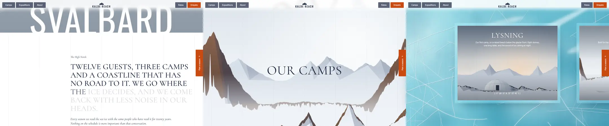

# Scroll Scrub Story

Scroll is the timeline, and nothing plays on its own. Each section owns one registered custom property, `--p`, that runs from 0 to 1 while the section crosses the viewport. Every visual change in that section (opacity per word, a stroke offset, a clip-path inset, strip positions, a track translation) is a `calc()` of `--p`. The browser animates one number; CSS derives the rest.

Reference pattern: luxury travel and hospitality sites (polar expeditions, safari lodges, private estates) built from slow, cinematic chapters: a huge condensed place name, a founder's statement that lights up word by word and ends in a drawn signature, a photograph that opens out of a frame, and a pinned "our camps" scene where the landscape gives way to texture and camp cards drift past.

Use this skill when the brief says: "story", "chapters", "cinematic", "luxury", "editorial scroll", "scrollytelling", "pinned section", "scroll-driven", or points at a reference like this. Do not use it for dashboards, docs, shops with long product grids, or anything people scan rather than read in order.

---

## 1. The Rules That Make It Look Expensive

1. **Scrub, never trigger.** Every effect follows the scrollbar both ways. Nothing fires a timed animation when it enters, so fast scrollers never wait and slow readers never miss anything. The only timed motion on the page is the hero title rising once on load.
2. **One number per section.** `@property --p { syntax: '<number>'; inherits: true; initial-value: 1 }`. Children read it. Adding an effect never adds a timeline.
3. **Initial value 1 is the safety net.** With no JS, no support, or reduced motion, `--p` stays at 1 and every section shows its finished state. Nothing can get stuck invisible.
4. **Light words, do not move them.** Statement words go from opacity 0.16 to 1, three words of overlap (`p * (n + 3) - i`). No slide, no blur, no per-letter split: the sentence stays readable as a block from the first pixel.
5. **Pin once.** One pinned scene per page, about 5 viewports tall (`520svh`). Pins everywhere feel like a slideshow you cannot skip.
6. **Phases inside the pin.** Split the pinned `--p` into named sub-ranges in CSS: `--a` = strips wipe (0 to 0.28), `--b` = card track (0.26 to 1). The overlap means something is always moving; a stretch of empty frame reads as broken.
7. **Strips alternate.** Six vertical strips, odd ones from below and even ones from above (`--dir: ±1`), staggered by 0.12 of the phase each. Each strip shows its own slice of the incoming image (`background-position: calc(k * -100vw / 6)`), so together they assemble one picture, not six.
8. **The frame opens, the photo settles.** The inset image's `clip-path: inset()` shrinks from 9 percent and a gutter-wide side margin to 0, while the image inside scales from 1.14 to 1. Two opposite movements read as depth.
9. **Type pairing does the luxury.** A tall condensed sans for the place name (Oswald 400, 17.6vw, letter-spacing 0.02em, cropped by the fold), a high-contrast serif for statements and titles (Cormorant 500, uppercase), and a neutral grotesk for UI (Inter Tight 500, 15px). Italic serif for captions and asides.
10. **Visible grid.** Six fixed column hairlines at 7 percent ink run over every section, photos included. They make long scenes feel measured and architectural.
11. **One warm accent on a cold palette.** Navy ink `#1D2840`, white and stone `#F4F2EE`, ice cyan, and a single burnt orange `#C94A12` for Enquire and the side tab (white on it: 4.7:1).

---

## 2. Layout Blueprint

```
HERO (100svh)       fog gradient + two low ridge silhouettes
                    [Camps][Expeditions][About]   ▲ KALDE REACH   [Rates][Enquire]
                    italic aside, left col                         Read the letter ▸, right col
                    S V A L B A R D   (17.6vw, white, cropped by the fold)

LETTER (cover 12→58) eyebrow "The High North"  (starts at column 3)
                    TWELVE GUESTS, THREE CAMPS AND A ...   (words: pale → ink)
                    italic paragraph
                    ~~~~ signature draws (cover 30→62) ~~~~   name / role

REVEAL (cover 0→48) inset photo → full bleed, caption on a frosted chip

CAMPS (520svh, contain 0→100, sticky 100svh stage)
  a 0→.28           landscape + "OUR CAMPS"  →  6 strips of ice wipe in (alternating)
  b .26→1           frosted cards glide from 72vw to "last card centred"

EXPEDITIONS         3 panels, one open (flex-grow 4), others blurred slivers; hover/focus opens
ENQUIRE             stone background, big serif "PLAN A SEASON", email field + orange button
```

- Headers and chips are 2px-radius rectangles on `rgba(29,40,68,.72)` with `backdrop-filter: blur(10px)`; they stay legible over fog, white and ice.
- Cards sit in a 10 to 20px frosted frame (`rgba(255,255,255,.2)` + `blur(14px) saturate(1.2)`), never a drop shadow card on white.
- Mobile (< 820px): one chip each side, side tab hidden, cards 84vw and 3:4, panels stacked and all open, letter starts at the left gutter.

---

## 3. Stack

- CSS scroll-driven animations (`animation-timeline: view()` + `animation-range`), Chromium 115+ and Safari 26+.
- 30 lines of JS: feature detection, a rAF fallback that writes `--p` for browsers without scroll timelines, and word splitting.
- No GSAP, no Lenis. Native scroll keeps keyboard, find-in-page, anchor links and screen readers working. (If a project already ships GSAP ScrollTrigger, it can write `--p` instead of the fallback; keep the CSS identical.)
- Fonts: Oswald, Cormorant, Inter Tight from Google Fonts.
- Next.js / React: render the markup on the server, run the driver in a client `useEffect`, and remove the scroll listener on unmount.

---

## 4. The Core CSS

```css
/* ===== One number per section. Everything visual is derived from --p (0..1). ===== */
@property --p { syntax: '<number>'; inherits: true; initial-value: 1; }
@keyframes scrub-p { from { --p: 0; } to { --p: 1; } }
.scrub { animation: scrub-p linear both; animation-timeline: view(); }

/* Column hairlines over the whole page: the grid stays visible under every scene */
.columns {
  position: fixed; inset: 0 var(--gutter); z-index: 40; pointer-events: none;
  display: grid; grid-template-columns: repeat(6, 1fr);
  border-right: 1px solid rgba(29, 40, 68, .07);
}
.columns i { border-left: 1px solid rgba(29, 40, 68, .07); }
```

Each effect is one rule against `--p`:

```css
/* ---------- Statement: words go from pale to ink ---------- */
.letter { position: relative; padding: clamp(120px, 18vh, 200px) var(--gutter) clamp(120px, 16vh, 180px); }
.letter__inner { margin-left: calc((100% - 0px) / 6 * 2); max-width: 60rem; }
.eyebrow { margin: 0 0 28px; font: italic 400 20px/1.2 var(--serif); }
.statement {
  margin: 0; font: 500 clamp(30px, 3.9vw, 58px)/1.06 var(--serif); text-transform: uppercase; letter-spacing: .005em;
}
.statement .w {
  /* word i of n lights between p = i/n and p = (i + 3)/n */
  opacity: clamp(.16, calc(var(--p) * (var(--n) + 3) - var(--i)), 1);
}
.letter__body { margin: 30px 0 0; max-width: 34em; font: italic 400 clamp(19px, 1.6vw, 23px)/1.4 var(--serif); }
.sign { margin-top: 40px; }
.sign svg { width: min(360px, 80%); height: auto; overflow: visible; }
.sign path { fill: none; stroke: var(--ink); stroke-width: 1.4; stroke-linecap: round; stroke-dasharray: 1; stroke-dashoffset: calc(1 - var(--p)); }
.sign b { display: block; margin-top: 12px; font-weight: 500; font-size: 15px; }
.sign small { color: var(--mute); font-size: 14px; }
```

```css
/* ---------- Inset image that opens to full bleed ---------- */
.reveal { position: relative; height: 92svh; overflow: hidden;
  clip-path: inset(calc((1 - var(--p)) * 9%) calc((1 - var(--p)) * (var(--gutter) + 2vw)) round calc((1 - var(--p)) * 6px)); }
.reveal__img { position: absolute; inset: -6% 0; background: var(--img-ridge) center / cover; transform: scale(calc(1.14 - var(--p) * .14)); }
.reveal__cap {
  position: absolute; left: var(--gutter); bottom: 6%; margin: 0; max-width: 24em; padding: 12px 18px; color: var(--ink);
  font: italic 500 clamp(18px, 1.5vw, 21px)/1.3 var(--serif);
  background: rgba(255, 255, 255, .74); -webkit-backdrop-filter: blur(12px); backdrop-filter: blur(12px); border-radius: 2px;
  opacity: clamp(0, calc(var(--p) * 3 - 2), 1);
}
```

The pinned scene. Everything under `.motion` only applies when JS confirmed that motion is allowed, so the same markup is a normal, static section without it:

```css
/* ---------- Camps: pinned scene, strips wipe in, cards glide ---------- */
.camps { position: relative; background: var(--img-ice) center top / 1600px auto repeat; } /* static flow: tile at native size, never stretch */
.camps__stage { position: relative; }
.camps__ice { position: absolute; inset: 0; background: var(--img-ice) center / cover; }
.camps__base { position: absolute; inset: 0; background: var(--img-ridge) center / cover; display: none; }
.camps__strips { display: none; }
.camps__title {
  margin: 0; padding: 18vh var(--gutter) 0; text-align: center; color: var(--ink);
  font: 400 clamp(44px, 6.4vw, 96px)/1 var(--serif); text-transform: uppercase; letter-spacing: .02em; text-shadow: 0 0 40px rgba(255, 255, 255, .9);
  position: relative;
}
.camps__track { position: relative; display: grid; gap: 6vw; padding: 8vh var(--gutter) 14vh; justify-items: center; }
.frost {
  width: min(100%, var(--cw)); padding: clamp(10px, 1.4vw, 20px); border-radius: 4px;
  background: rgba(255, 255, 255, .2); -webkit-backdrop-filter: blur(14px) saturate(1.2); backdrop-filter: blur(14px) saturate(1.2);
  box-shadow: 0 30px 80px -40px rgba(10, 40, 60, .55);
}
.card { position: relative; aspect-ratio: 4 / 3; overflow: hidden; color: #fff; background: #8b97a4 center / cover; display: grid; align-content: space-between; padding: 6% 7%; text-align: center; }
.card::before { content: ''; position: absolute; inset: 0; background: linear-gradient(rgba(20, 30, 46, .42), rgba(20, 30, 46, 0) 46%, rgba(20, 30, 46, 0) 64%, rgba(20, 30, 46, .5)); }
.card > * { position: relative; }
.card h3 { margin: 0; font: 400 clamp(32px, 3.6vw, 56px)/1 var(--serif); text-transform: uppercase; letter-spacing: .04em; }
.card p { margin: 14px auto 0; max-width: 30em; font-size: clamp(14px, 1.05vw, 16px); line-height: 1.45; }
.card .coords { font: 400 14px/1 var(--display); letter-spacing: .06em; }
.camps__note { position: relative; margin: 0 auto 10vh; padding: 14px 22px; width: fit-content; max-width: min(34em, calc(100% - 2 * var(--gutter))); color: var(--ink); text-align: center; font: italic 500 20px/1.35 var(--serif);
  background: rgba(255, 255, 255, .72); -webkit-backdrop-filter: blur(12px); backdrop-filter: blur(12px); border-radius: 2px; }

/* Motion layout only when JS confirmed motion is allowed: no-JS and reduced motion keep the static flow above */
.motion .camps { height: 520svh; background: none; }
.motion .camps__stage { position: sticky; top: 0; height: 100svh; overflow: hidden;
  --a: clamp(0, calc(var(--p) / .28), 1);
  --b: clamp(0, calc((var(--p) - .26) / .74), 1); }
.motion .camps__base { display: block; transform: scale(calc(1.08 - var(--a) * .08)); }
.motion .camps__ice { opacity: 0; }
.motion .camps__strips { display: grid; grid-template-columns: repeat(6, 1fr); position: absolute; inset: 0; }
.motion .strip {
  --r: clamp(0, calc(var(--a) * 1.6 - var(--k) * .12), 1);
  background: var(--img-ice) no-repeat;
  background-size: 100vw 100svh; background-position: calc(var(--k) * -100vw / 6) 0;
  transform: translateY(calc((1 - var(--r)) * 101% * var(--dir)));
}
.motion .camps__title { position: absolute; inset: 0; display: grid; place-items: center; padding: 0 var(--gutter); opacity: calc(1 - var(--a) * 1.4); }
.motion .camps__note { position: absolute; left: 0; right: 0; bottom: 7vh; margin: 0 auto; opacity: clamp(0, calc(var(--a) * 4 - 3 - var(--b) * 6), 1); }
.motion .camps__track {
  position: absolute; top: 50%; left: var(--start); display: flex; gap: var(--gap); padding: 0; align-items: center;
  /* starts peeking in at --start, ends with the last card centred: travel = start - 50vw + (n - 1)(card + gap) + card / 2 */
  transform: translate(calc(var(--b) * -1 * (var(--start) - 50vw + (var(--n) - 1) * (var(--cw) + var(--gap)) + var(--cw) / 2)), -50%);
}
.motion .frost { flex: none; width: var(--cw); }
.camps { --cw: min(52vw, 760px); --gap: 8vw; --n: 3; --start: 72vw; }
```

Mobile overrides:

```css
.camps { --cw: 84vw; --gap: 6vw; --start: 88vw; }
.card { aspect-ratio: 3 / 4; }
```

---

## 5. The Driver (complete)

```js
// Every [data-range="cover|contain start end"] element gets one number, --p, from 0 to 1.
// Native scroll-driven animations when the browser has them, a rAF fallback when it does not,
// and nothing at all under reduced motion: --p keeps its registered initial value of 1 (final state).
const reduce = matchMedia('(prefers-reduced-motion: reduce)').matches;
const native = CSS.supports('animation-timeline: view()') && CSS.supports('animation-range: cover 0% cover 100%');

const scrubs = [...document.querySelectorAll('[data-range]')].map((el) => {
  const [name, a, b] = el.dataset.range.split(' ');
  return { el, name, a: +a / 100, b: +b / 100 };
});

function progress({ el, name, a, b }) {
  const r = el.getBoundingClientRect(), vh = innerHeight;
  const c = name === 'contain'
    ? -r.top / Math.max(1, r.height - vh)        // tall pinned section: 0 when its top hits the top, 1 when its bottom hits the bottom
    : (vh - r.top) / (vh + r.height);            // cover: 0 when its top enters, 1 when its bottom leaves
  return Math.min(1, Math.max(0, (c - a) / (b - a)));
}

if (!reduce) {
  document.documentElement.classList.add('motion');
  if (native) {
    for (const s of scrubs) {
      s.el.style.animationRange = `${s.name} ${s.a * 100}% ${s.name} ${s.b * 100}%`;
      s.el.classList.add('scrub');
    }
  } else {
    let queued = false;
    const update = () => {
      queued = false;
      for (const s of scrubs) s.el.style.setProperty('--p', progress(s).toFixed(4));
    };
    const queue = () => { if (!queued) { queued = true; requestAnimationFrame(update); } };
    addEventListener('scroll', queue, { passive: true });
    addEventListener('resize', queue);
    update();
  }
}

// Split a statement into words that each know their index (--i) and the total (--n).
for (const el of document.querySelectorAll('[data-words]')) {
  const words = el.textContent.trim().split(/\s+/);
  el.setAttribute('aria-label', el.textContent.trim());
  el.style.setProperty('--n', words.length);
  el.innerHTML = words.map((w, i) => `<span class="w" aria-hidden="true" style="--i:${i}">${w}</span>`).join(' ');
}
```

Markup contract:

```html
<p class="statement" data-range="cover 12 58" data-words>Twelve guests, three camps ...</p>
<div class="sign" data-range="cover 30 62"><svg viewBox="0 0 360 80"><path pathLength="1" d="..."/></svg></div>
<section class="reveal" data-range="cover 0 48"><div class="reveal__img" role="img" aria-label="..."></div></section>
<section class="camps" data-range="contain 0 100">
  <div class="camps__stage">
    <div class="camps__ice"></div><div class="camps__base"></div>
    <div class="camps__strips"><i class="strip" style="--k:0;--dir:1"></i> ... <i class="strip" style="--k:5;--dir:-1"></i></div>
    <h2 class="camps__title">Our camps</h2>
    <div class="camps__track"><article class="frost"><div class="card">...</div></article> ...</div>
  </div>
</section>
```

Why it is built this way:

- **`data-range` is the single source of truth.** In native mode the driver copies it into `animation-range`; in fallback mode it computes the same progress in JS. The two can never drift apart.
- **`cover`** = 0 when the element's top enters the bottom of the viewport, 1 when its bottom leaves the top. **`contain`** on an element taller than the viewport = 0 when its top reaches the top, 1 when its bottom reaches the bottom: exactly the pinned stretch of a sticky child.
- **The `animation` shorthand resets `animation-timeline` and `animation-range`.** Declare the timeline after the shorthand in the same rule, and set the range inline (inline wins).
- **`pathLength="1"`** turns any signature path into a 0 to 1 dash, so `stroke-dashoffset: calc(1 - var(--p))` draws it without measuring.
- **Words stay accessible.** The full sentence goes into `aria-label`, the split spans are `aria-hidden`.

---

## 6. Imagery Without Photos (optional, complete)

The demo paints every image at load time on canvas, then serves it as a blob URL in a CSS variable. Real projects should use real photography; this shows the art direction (layered peaks, faces lit from one side, haze, ice with glowing fractures) and keeps the demo free of licensed images.

```js
// ===== Generated imagery (original, no photos) =====
function rng(seed) { // mulberry32
  return () => { seed |= 0; seed = (seed + 0x6D2B79F5) | 0; let t = Math.imul(seed ^ (seed >>> 15), 1 | seed);
    t = (t + Math.imul(t ^ (t >>> 7), 61 | t)) ^ t; return ((t ^ (t >>> 14)) >>> 0) / 4294967296; };
}
function noise1d(rand, n, octaves = 5, div = 3) {
  const out = new Float32Array(n);
  for (let o = 0; o < octaves; o++) {
    const step = Math.max(2, Math.floor(n / (div * 2 ** o))), amp = 1 / 2 ** o;
    const pts = Array.from({ length: Math.ceil(n / step) + 2 }, () => rand() * 2 - 1);
    for (let x = 0; x < n; x++) {
      const i = Math.floor(x / step), f = (x % step) / step, s = f * f * (3 - 2 * f);
      out[x] += (pts[i] * (1 - s) + pts[i + 1] * s) * amp;
    }
  }
  return out;
}
const mix = (a, b, t) => a.map((v, i) => Math.round(v + (b[i] - v) * t));
const rgbStr = (c, a = 1) => `rgba(${c[0]},${c[1]},${c[2]},${a})`;

function grain(ctx, w, h, amount, rand) {
  const img = ctx.getImageData(0, 0, w, h), d = img.data;
  for (let i = 0; i < d.length; i += 4) { const g = (rand() - 0.5) * amount; d[i] += g; d[i + 1] += g; d[i + 2] += g; }
  ctx.putImageData(img, 0, 0);
}

// Layered mountains: a few peaks plus fractal roughness, faces lit from the upper left,
// rock above a ragged snowline, snow below. Lighting uses a smoothed slope so faces read as broad planes.
function paintLandscape(w, h, o) {
  const c = document.createElement('canvas'); c.width = w; c.height = h;
  const ctx = c.getContext('2d', { willReadFrequently: true }), rand = rng(o.seed);
  const sky = ctx.createLinearGradient(0, 0, 0, h * 0.75);
  sky.addColorStop(0, o.sky[0]); sky.addColorStop(1, o.sky[1]);
  ctx.fillStyle = sky; ctx.fillRect(0, 0, w, h);
  if (o.glow) { const g = ctx.createRadialGradient(w * o.glow[0], h * o.glow[1], 0, w * o.glow[0], h * o.glow[1], w * 0.5);
    g.addColorStop(0, o.glow[2]); g.addColorStop(1, 'rgba(255,255,255,0)'); ctx.fillStyle = g; ctx.fillRect(0, 0, w, h); }
  o.layers.forEach((L, li) => {
    const prof = new Float32Array(w), rough = noise1d(rand, w, 4), jag = noise1d(rand, w, 4, 60);
    const peaks = Array.from({ length: L.peaks || 4 }, () => ({ cx: rand() * w, hl: w * (0.06 + rand() * 0.18), hr: w * (0.06 + rand() * 0.18), ph: 0.4 + rand() * 0.6 }));
    for (const P of peaks) for (let x = 0; x < w; x++) { // asymmetric flanks
      const d = x < P.cx ? (P.cx - x) / P.hl : (x - P.cx) / P.hr;
      if (d < 1) prof[x] = Math.max(prof[x], P.ph * Math.pow(1 - d, L.sharp || 1.25));
    }
    const top = new Float32Array(w);
    for (let x = 0; x < w; x++) top[x] = h * L.y - (prof[x] + rough[x] * (L.rough || 0.12) + jag[x] * 0.03 * (0.3 + prof[x])) * h * L.amp;
    const ridgePath = () => { ctx.beginPath(); ctx.moveTo(0, h); for (let x = 0; x < w; x += 2) ctx.lineTo(x, top[x]); ctx.lineTo(w, top[w - 1]); ctx.lineTo(w, h); ctx.closePath(); };
    const peakY = h * (L.y - L.amp);
    // 1. the body: one path, one vertical gradient
    ridgePath();
    const body = ctx.createLinearGradient(0, peakY, 0, h);
    if (L.flat) { body.addColorStop(0, rgbStr(L.light)); body.addColorStop(1, rgbStr(mix(L.shade, L.light, 0.6))); }
    else { body.addColorStop(0, rgbStr(mix(L.snowShade, [250, 252, 255], 0.75))); body.addColorStop(1, 'rgb(244,247,251)'); }
    ctx.fillStyle = body; ctx.fill();
    ctx.save(); ridgePath(); ctx.clip();
    // 2. rock: a band under the ridge, deeper where the face is steep, with ragged couloirs
    if (!L.flat) {
      const steep = new Float32Array(w), snowN = noise1d(rand, w, 3, 10), edge = noise1d(rand, w, 2, 90);
      for (let x = 0; x < w; x++) steep[x] = Math.min(1, Math.abs(top[Math.min(w - 1, x + 4)] - top[Math.max(0, x - 4)]) / 8 * 1.3);
      for (let pass = 0; pass < 6; pass++) for (let x = 1; x < w - 1; x++) steep[x] = (steep[x - 1] + steep[x] + steep[x + 1]) / 3;
      ctx.beginPath(); ctx.moveTo(0, top[0]);
      for (let x = 0; x < w; x += 2) ctx.lineTo(x, top[x] - 2);
      for (let x = w - 1; x >= 0; x -= 2) ctx.lineTo(x, top[x] + h * L.amp * L.snow * (0.1 + 0.9 * steep[x]) * (0.25 + prof[x]) * (0.7 + 0.45 * snowN[x]) + edge[x] * 6);
      ctx.closePath();
      const rg = ctx.createLinearGradient(0, peakY, 0, h * L.y); rg.addColorStop(0, rgbStr(L.rock)); rg.addColorStop(1, rgbStr(mix(L.rock, L.rockDark, 0.5)));
      ctx.fillStyle = rg; ctx.fill();
    }
    // 3. shadow faces: from each summit, the right-hand flank down to the foot, like a poster print
    for (const P of peaks) {
      const x0 = Math.round(Math.max(0, Math.min(w - 1, P.cx))), x1 = Math.min(w - 1, Math.round(P.cx + P.hr));
      ctx.beginPath(); ctx.moveTo(x0, top[x0]);
      for (let x = x0; x <= x1; x += 2) ctx.lineTo(x, top[x]);
      ctx.lineTo(P.cx + P.hr * (0.15 + rand() * 0.2), h * L.y + h * L.amp * 0.05); ctx.closePath(); // ends at the foot, never a hard vertical
      ctx.fillStyle = L.flat ? 'rgba(60,76,104,.16)' : 'rgba(40,56,90,.26)'; ctx.fill();
    }
    ctx.restore();
    if (li < o.layers.length - 1) { // atmospheric haze below each layer's peaks
      const y0 = h * (L.y - L.amp * 0.4), hz = ctx.createLinearGradient(0, y0, 0, h);
      hz.addColorStop(0, 'rgba(238,242,247,0)'); hz.addColorStop(0.55, `rgba(238,242,247,${o.haze})`);
      ctx.fillStyle = hz; ctx.fillRect(0, y0, w, h - y0);
    }
  });
  if (o.dome) { // a camp dome, for the camp cards
    const [dx, dy, dr] = [w * o.dome[0], h * o.dome[1], w * o.dome[2]];
    ctx.fillStyle = 'rgba(30,40,56,.2)'; ctx.beginPath(); ctx.ellipse(dx + dr * 0.3, dy + 2, dr * 1.3, dr * 0.16, 0, 0, Math.PI * 2); ctx.fill();
    const dg = ctx.createLinearGradient(dx - dr, 0, dx + dr, 0); dg.addColorStop(0, '#fbfcfd'); dg.addColorStop(1, '#aeb9c6');
    ctx.fillStyle = dg; ctx.beginPath(); ctx.ellipse(dx, dy, dr, dr * 0.8, 0, Math.PI, 0); ctx.fill();
    ctx.strokeStyle = 'rgba(70,84,104,.3)'; ctx.lineWidth = 1.2;
    for (let k = 1; k <= 2; k++) { ctx.beginPath(); ctx.ellipse(dx, dy, k * dr * 0.33, dr * 0.8, 0, Math.PI, 0); ctx.stroke(); }
    ctx.beginPath(); ctx.moveTo(dx - dr, dy - dr * 0.4); ctx.quadraticCurveTo(dx, dy - dr * 0.62, dx + dr, dy - dr * 0.4); ctx.stroke();
    ctx.fillStyle = o.dome[3] || '#2a3346'; ctx.fillRect(dx - dr * 0.12, dy - dr * 0.38, dr * 0.24, dr * 0.38);
  }
  grain(ctx, w, h, 9, rand);
  return c;
}

// Sea ice: mottled cyan with deep and pale zones, long branching fractures with a soft glow,
// and a few wind-blown snow drifts.
function paintIce(w, h, seed) {
  const c = document.createElement('canvas'); c.width = w; c.height = h;
  const ctx = c.getContext('2d', { willReadFrequently: true }), rand = rng(seed);
  const g = ctx.createLinearGradient(0, 0, w, h); g.addColorStop(0, '#a6e0ea'); g.addColorStop(0.55, '#62c0d4'); g.addColorStop(1, '#3b98b4');
  ctx.fillStyle = g; ctx.fillRect(0, 0, w, h);
  for (let i = 0; i < 140; i++) {
    const x = rand() * w, y = rand() * h, r = 30 + rand() * 260, rg = ctx.createRadialGradient(x, y, 0, x, y, r);
    const col = rand() < 0.55 ? '255,255,255' : '18,104,136';
    rg.addColorStop(0, `rgba(${col},${0.04 + rand() * 0.1})`); rg.addColorStop(1, `rgba(${col},0)`);
    ctx.fillStyle = rg; ctx.fillRect(x - r, y - r, r * 2, r * 2);
  }
  const paths = [];
  const crack = (x, y, a, len, width, depth) => {
    const pts = [[x, y]];
    for (let s = 0; s < len; s += 18) {
      a += (rand() - 0.5) * 0.16; x += Math.cos(a) * 18; y += Math.sin(a) * 18; pts.push([x, y]);
      if (depth < 2 && rand() < 0.07) crack(x, y, a + (rand() < 0.5 ? 1 : -1) * (0.7 + rand() * 0.6), len * 0.45, width * 0.6, depth + 1);
    }
    paths.push({ pts, width });
  };
  for (let i = 0; i < 14; i++) crack(rand() * w, rand() * h, rand() * Math.PI * 2, 500 + rand() * 1200, 0.8 + rand() * 2.2, 0);
  ctx.lineCap = 'round'; ctx.lineJoin = 'round';
  const stroke = (k, style, ox = 0, oy = 0) => {
    ctx.strokeStyle = style;
    for (const { pts, width } of paths) { ctx.lineWidth = width * k; ctx.beginPath(); pts.forEach(([x, y], i) => ctx[i ? 'lineTo' : 'moveTo'](x + ox, y + oy)); ctx.stroke(); }
  };
  stroke(1.2, 'rgba(10,70,100,.28)', 1.5, 2);   // the crack's depth
  stroke(6, 'rgba(255,255,255,.09)');           // frosted halo
  stroke(1, 'rgba(255,255,255,.8)');            // bright edge
  for (let i = 0; i < 3; i++) { // wind-blown snow drifts: long soft streaks
    const x = rand() * w, y = rand() * h, a = -0.5 + rand() * 0.3, len = 160 + rand() * 300;
    ctx.save(); ctx.translate(x, y); ctx.rotate(a); ctx.filter = 'blur(10px)';
    ctx.fillStyle = `rgba(255,255,255,${0.35 + rand() * 0.3})`; ctx.beginPath(); ctx.ellipse(0, 0, len, 14 + rand() * 26, 0, 0, Math.PI * 2); ctx.fill();
    ctx.restore();
  }
  grain(ctx, w, h, 7, rand);
  return c;
}

const ROCK = { rock: [138, 100, 80], rockDark: [52, 38, 34], snowShade: [138, 160, 190] };
const scenes = {
  ridge: () => paintLandscape(1600, 1000, { seed: 7, sky: ['#DCE4EC', '#F7F9FB'], haze: 0.7, glow: [0.72, 0.28, 'rgba(255,255,255,.8)'],
    layers: [
      { y: 0.56, amp: 0.2, flat: true, peaks: 6, shade: [170, 184, 200], light: [218, 226, 236] },
      { y: 0.72, amp: 0.5, snow: 0.6, peaks: 3, sharp: 1.35, ...ROCK },
      { y: 0.98, amp: 0.3, snow: 0.18, peaks: 4, ...ROCK, rock: [150, 112, 88] },
    ] }),
  1: () => paintLandscape(900, 680, { seed: 21, sky: ['#93A3B6', '#EDE5DC'], haze: 0.55, glow: [0.62, 0.62, 'rgba(255,214,176,.6)'], dome: [0.4, 0.86, 0.13],
    layers: [{ y: 0.66, amp: 0.2, flat: true, peaks: 5, shade: [140, 152, 170], light: [192, 200, 212] }, { y: 0.87, amp: 0.08, snow: 0.3, peaks: 6, ...ROCK, rock: [104, 86, 76] }] }),
  2: () => paintLandscape(900, 680, { seed: 34, sky: ['#CDD6DF', '#F4F6F8'], haze: 0.75, dome: [0.56, 0.88, 0.15, '#1f2633'],
    layers: [{ y: 0.72, amp: 0.42, snow: 0.55, peaks: 2, sharp: 1.4, ...ROCK }, { y: 0.89, amp: 0.03, flat: true, shade: [214, 222, 230], light: [246, 248, 250] }] }),
  3: () => paintLandscape(900, 680, { seed: 52, sky: ['#26314B', '#7E829E'], haze: 0.25, glow: [0.3, 0.22, 'rgba(120,236,196,.4)'], dome: [0.64, 0.86, 0.12, '#f2b25c'],
    layers: [{ y: 0.68, amp: 0.26, flat: true, peaks: 4, shade: [56, 66, 92], light: [96, 104, 134] }, { y: 0.87, amp: 0.05, snow: 0.2, ...ROCK, snowShade: [96, 110, 146] }] }),
  4: () => paintLandscape(900, 1000, { seed: 61, sky: ['#7398C0', '#DCE6EF'], haze: 0.45,
    layers: [{ y: 0.66, amp: 0.16, flat: true, peaks: 5, shade: [178, 194, 210], light: [228, 234, 242] }, { y: 0.84, amp: 0.04, flat: true, shade: [222, 230, 238], light: [250, 251, 252] }] }),
  5: () => paintLandscape(900, 1000, { seed: 75, sky: ['#B4C2D0', '#F1F3F5'], haze: 0.6,
    layers: [{ y: 0.64, amp: 0.44, snow: 0.55, peaks: 3, sharp: 1.3, ...ROCK }, { y: 0.9, amp: 0.2, snow: 0.15, peaks: 4, ...ROCK, rock: [120, 100, 90] }] }),
  6: () => paintLandscape(900, 1000, { seed: 88, sky: ['#1A2540', '#56648C'], haze: 0.25, glow: [0.55, 0.22, 'rgba(110,230,186,.45)'],
    layers: [{ y: 0.7, amp: 0.26, flat: true, peaks: 4, shade: [40, 50, 76], light: [70, 82, 114] }, { y: 0.88, amp: 0.05, flat: true, shade: [92, 104, 138], light: [146, 156, 188] }] }),
};

const toURL = (canvas) => new Promise((res) => canvas.toBlob((b) => res(URL.createObjectURL(b)), 'image/webp', 0.86));
const idle = window.requestIdleCallback || ((fn) => setTimeout(fn, 1));
(async () => {
  const root = document.documentElement.style;
  root.setProperty('--img-ridge', `url(${await toURL(scenes.ridge())})`);
  root.setProperty('--img-ice', `url(${await toURL(paintIce(1600, 1000, 3))})`);
  idle(async () => {
    for (const el of document.querySelectorAll('[data-scene]')) el.style.backgroundImage = `url(${await toURL(scenes[el.dataset.scene]())})`;
  });
})();
```

Painting lessons learned:

- Drawing per pixel column streaks: lighting changes column to column read as vertical stripes. Fill each mountain as one path with one gradient, then add shadow faces as polygons from each summit down its right flank (poster print logic).
- Shadow polygons must end at the foot of the flank, never drop vertically to the bottom of the canvas, or they read as glass shards.
- Rock depth follows steepness and summit height, smoothed over many passes; high-frequency noise in that edge turns into drips.
- Ice cracks need a dark offset stroke (depth), a wide faint stroke (frost halo) and a thin bright stroke, and should run straight with small direction jitter. Curly cracks read as hair.

---

## 7. Fallbacks and Accessibility

- **No scroll timelines:** the rAF fallback writes `--p` inline. Same look, verified by forcing `CSS.supports` to return false.
- **No JS:** `--p` stays at its initial value of 1; the camps section is a normal flow (title, note, three cards on tiled ice). Every word, image and card is visible.
- **`prefers-reduced-motion: reduce`:** the driver never adds `.motion` or `.scrub`, so there is no pinning, no strip wipe and no scrubbing at all. The hero title skips its rise, the trip panels skip their transitions. Content is identical.
- **Never scroll-jack.** Native scroll, native anchors. Pinning uses `position: sticky`, so the page height is honest and the scrollbar is truthful.
- **Contrast:** navy on white 14.7:1, white on burnt orange 4.7:1, white chip text on the navy glass about 6:1 on white backgrounds, captions on frosted chips in navy. Text over generated images always sits on a gradient scrim (`rgba(16,24,40,.5)` top, `.78` bottom).
- Decorative layers (`.columns`, strips, ice, ridge silhouettes, card images) are `aria-hidden`; the reveal photo has `role="img"` and a label.
- `:focus-visible` is a 2px orange outline; on dark panels it switches to white and insets so it is not clipped.

---

## 8. Performance Checklist

- [ ] One registered custom property per section. Custom property animations run on the main thread, so keep derived work to `opacity`, `transform`, `clip-path` and `stroke-dashoffset`.
- [ ] Do not scrub `filter: blur()` or `backdrop-filter` values: repaint cost spikes. The frosted frames are static.
- [ ] Fallback mode: one passive scroll listener, one rAF per frame, `getBoundingClientRect` only on the handful of `[data-range]` elements.
- [ ] Generated images: painted once after load, the two scene images first, card and panel images in `requestIdleCallback`; measure the paint on your slowest target device. Real photos: AVIF/WebP, `sizes` set, the pinned background at most 2400px wide.
- [ ] Pinned stage is `overflow: hidden` and exactly `100svh`; strips use a fixed `100vw 100svh` background size so no layout depends on image load.
- [ ] LCP is the hero title text, not an image.

---

## 9. Anti-Patterns (Instant Slop)

- Fade-up-on-enter for every block, timed, firing once: the page plays a slideshow at the reader.
- Smooth-scroll libraries that hijack the wheel to make scrubbing "smoother". Native scrubbing is already smooth and keeps the browser's own behavior.
- Words that slide, blur or bounce in. Lighting words is enough.
- Three pinned sections in a row. One pin, earned.
- A pinned scene with an empty middle: strips finish, then nothing until the next card. Overlap the phases.
- Strips that all move in one direction or each show the whole image (six tiny copies instead of one picture).
- Text in white on light snow or sky photos with no scrim or chip.
- `initial-value: 0` on the progress property: no JS or no support leaves the page blank.
- Copying a studio's photography, copy, or founder's signature. Shoot or paint your own, write your own.

---

## 10. Working Demo

[`demo/index.html`](demo/index.html) is a complete single-file page for an invented Arctic expedition company, Kalde Reach (Tromsø): fog hero with a huge condensed "SVALBARD", a founder's statement that lights word by word with a drawn signature, an inset landscape that opens to full bleed, a pinned camps scene (landscape replaced by six alternating strips of sea ice, then three frosted camp cards gliding across), expedition panels that open on hover and focus, and an enquiry footer. All imagery is generated on canvas at load.

Verified with `node scripts/verify-demo.mjs skills/scroll-scrub-story-skill/demo` (desktop, mobile and reduced motion; no console errors, no failed requests, no horizontal overflow), plus 36-stop desktop and 22-stop mobile scroll sweeps in native mode, the forced JS fallback, and a reduced-motion sweep through the middle of the page.



Lessons learned while building it (already folded into the rules above):

- The first generated landscapes were thin brown bands over streaky snow. Path fills plus poster-style shadow faces fixed both.
- With the card phase starting after the strips, two whole frames showed empty ice. Starting the track already peeking in at 72vw and overlapping the phases removed the dead stretch.
- White captions and a white "OUR CAMPS" over light snow failed contrast. Captions moved onto frosted chips, the title went navy with a white glow.
- A fixed side tab sat on top of the statement on mobile. It is hidden below 820px; the header's Enquire chip covers the same job.
- In the static (reduced motion) flow, `background-size: cover` stretched the ice across a very tall section and fattened every crack. It now tiles at its native 1600px.
- The hero title cropped by 8 percent of its size cut off too much of the letters; 3.5 percent keeps the cropped look and the word readable.

---

## 11. Pre-Flight

Before shipping, answer yes to all:

1. Does every scroll effect follow the scrollbar in both directions, with nothing timed on enter?
2. Is there exactly one progress number per section, registered with `initial-value: 1`?
3. With JS off, and separately with reduced motion, is every word, image and card visible in a normal flow?
4. Is there only one pinned scene, and is something moving at every point of it?
5. Does every line of text over an image have a scrim or a frosted chip?
6. Does anchor navigation (`#camps`, `#enquire`) still land correctly, with native scrolling?
7. Mobile: do the cards fit (84vw), and does nothing fixed sit on top of body copy?
