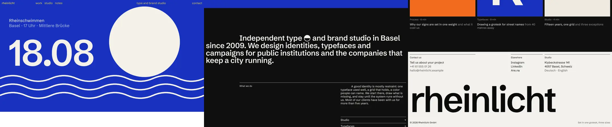

# Swiss Grid Typography

The page has almost no "design elements". It has one typeface, three sizes, one gray, and a six-column grid that everything obeys. Indents are not tabs: they are column positions. That discipline is what makes a studio site read as Swiss and expensive instead of empty.

Reference pattern: European agency and studio sites (Geneva, Zürich, Basel, Amsterdam) with a grotesk statement paragraph that starts one column in, a small inline pictogram inside the headline, a "What we do" split with a hairline, and a staggered two-column case list captioned in black and gray.

Use this skill when the brief says: "Swiss", "editorial", "typographic", "studio", "agency", "minimal but not empty", "grid", or the client has strong work images and needs the site to step back. Do not use it when the brand has no imagery at all (the type system needs strong pictures to frame) or when the copy is long-form reading (use an editorial measure instead).

---

## 1. The Rules That Make It Look Expensive

1. **One family, three sizes, two weights.** Display 53px / 600 / line-height 1.0 / tracking -0.012em; UI 20px / 400 / line-height 1.2 / tracking +0.01em; small 16px / 400. Nothing else on the page, including the footer and the mobile menu.
2. **Hierarchy by gray, not by size.** Secondary text is the same size as the line above it, in gray. A case caption is a black title over a gray subtitle at 20px; a link to "All projects" is gray, not smaller.
3. **The gray must still pass.** Many reference sites use #8C8C8C on white (3.3:1, fails AA at 20px regular). Use #737373 (4.7:1). On black use #9A9A9A (7.0:1).
4. **Indents are column positions.** The statement's first line starts at column 2 (`text-indent: calc(var(--col) + var(--g))`), so it lines up with the second item of the nav above it. A body paragraph in columns 5 to 6 indents its first line by a third of a column. Measure the column once, use it everywhere.
5. **A glyph inside the sentence.** One pictogram (the brand mark) sits in the display line like a word: 0.86em square, `vertical-align: -0.1em`, `currentColor`, decorative to screen readers.
6. **Navigation is text on the grid.** Wordmark in column 1, links from column 2, a descriptor in column 5, contact right-aligned in column 6. No pills, no buttons, no backgrounds; underline on hover.
7. **The header inverts, it does not sit on a bar.** `color: #fff; mix-blend-mode: difference` on a fixed header: black on paper, light on dark images, a complementary color on saturated ones. Pick hero colors that stay far from 50 percent gray, where difference loses contrast.
8. **Hairlines are 1px ink, started on a column.** The "What we do" rule runs from column 2 to the edge, never from the page margin.
9. **Whitespace is the grid's empty columns.** Cases alternate columns 1 to 3 and 4 to 6, the right one dropped by a quarter of the viewport. Leave the empty cells empty.
10. **Pictures are flat and strong.** Project images edge to edge in their cell, no radius, no shadow, aspect 10:7. Captions start on the image's left edge, 12px below.

---

## 2. Layout Blueprint (1440 wide, 6 columns, 12px margins and gaps)

```
col:  1            2            3            4            5            6
      rheinlicht   work studio notes                      type and…    contact     ← fixed, difference blend
      ┌──────────────────────── hero poster, full bleed, 88svh ───────────────────────┐
      └────────────────────────────────────────────────────────────────────────────────┘
                   Independent type ◐ and brand studio in Basel                         ← first line at col 2
      since 2009. We design identities, typefaces and campaigns for public …            ← rest from col 1
                   ─────────────────────────────────────────────────────────────────    ← rule col 2→6
                   What we do                             ␣␣␣A good identity is …      ← label col 2, text col 5-6
                                                          Studio                    →
                                                          Typefaces                 →
      Case studies                                                     All projects → (gray)
      [ image cols 1-3 ]
      Stadtbad Basel                           [ image cols 4-6, dropped ]
      Four public pools… (gray)                Kunsthalle Riehen / A poster system… (gray)
      Notes: three squares, 2 columns each
      ███ footer: same grid inverted, huge wordmark at 17.4vw ███
```

Phones (< 760px): 4 columns, same rules. The statement still indents one column; "What we do" text and links move to columns 2 to 4; cases stack (two staggered columns from 480px); the header shows wordmark, contact and a menu button, and hides while the reader scrolls down.

---

## 3. Stack

- CSS grid with `repeat(var(--cols), minmax(0, 1fr))`, container query units (`cqw`) for the column width, `mix-blend-mode`, inline SVG.
- 25 lines of JS, only for the mobile menu and the hide-on-scroll header. All content, images included, is in the HTML: the page is complete without JS.
- Font: one grotesk from Google Fonts (Schibsted Grotesk here); any neutral grotesk with a real 600 works (Hanken Grotesk, Instrument Sans, Geist). Commercial equivalents: Neue Haas Unica, GT Standard, Suisse Int'l.

---

## 4. The System (complete CSS)

```css
/* ===== The system: one family, three sizes, one gray, a 6-column grid ===== */
:root {
  --paper: #FFFFFF;
  --ink: #0B0B0B;
  --gray: #737373;               /* same size as the text it sits under, never smaller; 4.7:1 on white */
  --night: #0B0B0B;
  --night-gray: #9A9A9A;         /* 7.0:1 on --night */
  --sans: 'Schibsted Grotesk', 'Helvetica Neue', Helvetica, Arial, sans-serif;

  --t-display: clamp(30px, 3.66vw, 56px);  /* 53px at 1440 */
  --t-ui: clamp(17px, 1.39vw, 20px);       /* 20px at 1440 */
  --t-small: clamp(14px, 1.11vw, 16px);

  --cols: 6;
  --m: clamp(12px, .9vw, 16px);            /* page margin */
  --g: clamp(12px, .9vw, 16px);            /* column gap */
  /* one column, measured from the page container so indents land on the grid at every width */
  --col: calc((100vw - 2 * var(--m) - (var(--cols) - 1) * var(--g)) / var(--cols));
}
/* The container is .page, never an ancestor of the fixed header: container-type adds layout
   containment, which would turn position: fixed into "fixed to this box" and scroll it away. */
@supports (width: 1cqw) {
  .page { container-type: inline-size; }
  .page * { --col: calc((100cqw - 2 * var(--m) - (var(--cols) - 1) * var(--g)) / var(--cols)); }
}
@media (max-width: 760px) { :root { --cols: 4; } }

*, *::before, *::after { box-sizing: border-box; }
html, body { background: var(--paper); color: var(--ink); }
html { -webkit-text-size-adjust: 100%; }
body {
  margin: 0; font: 400 var(--t-ui)/1.2 var(--sans); letter-spacing: .01em;
  -webkit-font-smoothing: antialiased; text-rendering: optimizeLegibility; font-kerning: normal;
}
a { color: inherit; text-decoration: none; }
img, svg { display: block; max-width: 100%; }
:focus-visible { outline: 2px solid currentColor; outline-offset: 3px; }
.skip { position: absolute; left: var(--m); top: -80px; z-index: 90; padding: 8px 12px; background: var(--ink); color: var(--paper); }
.skip:focus { top: var(--m); }

.grid { display: grid; grid-template-columns: repeat(var(--cols), minmax(0, 1fr)); column-gap: var(--g); padding-inline: var(--m); }
.gray { color: var(--gray); }
```

The header and its hide-on-scroll state:

```css
/* ---------- Header: plain text on the grid, inverted over whatever is under it ---------- */
.top {
  position: fixed; inset: 0 0 auto; z-index: 50; padding-block: 10px;
  color: #fff; mix-blend-mode: difference;   /* black on paper, light on dark images, a complement on color */
  align-items: baseline;
  transition: transform .35s cubic-bezier(.2, .7, .1, 1);
}
/* out of the way while reading down, back as soon as the reader scrolls up or tabs into it */
.top.is-away:not(:focus-within) { transform: translateY(-120%); }
.top a:hover, .top button:hover { text-decoration: underline; text-underline-offset: 3px; text-decoration-thickness: 1px; }
.wordmark { grid-column: 1; font-weight: 500; }
.nav { grid-column: 2 / 4; display: flex; gap: .8em; }
.tagline { grid-column: 5; }
.contact { grid-column: 6; justify-self: end; }
.menu-btn { display: none; }
```

Statement with the column indent and the inline glyph:

```css
/* ---------- Statement: first line indented to column 2 ---------- */
.statement {
  grid-column: 1 / -1; margin: 0; padding-block: clamp(80px, 13vw, 190px) clamp(64px, 9vw, 130px);
  font-size: var(--t-display); font-weight: 600; line-height: 1; letter-spacing: -.012em;
  text-indent: calc(var(--col) + var(--g));
  hanging-punctuation: first;
}
/* A glyph that sits in the sentence like a word: cap height tall, on the baseline */
.glyph { display: inline-block; width: .86em; height: .86em; vertical-align: -.1em; margin-inline: .04em; }
```

```html
<p class="statement">Independent type <svg class="glyph" viewBox="0 0 40 40" aria-hidden="true"><circle cx="20" cy="20" r="18.5" fill="none" stroke="currentColor" stroke-width="3"/><path d="M1.5 20 A18.5 18.5 0 0 1 38.5 20 Z" fill="currentColor"/></svg> and brand studio in Basel since 2009. …</p>
```

The split, the cases and the notes:

```css
/* ---------- What we do: hairline from column 2, label in 2, text in 5-6 ---------- */
.what { padding-bottom: clamp(80px, 12vw, 170px); row-gap: 14px; }
.what__rule { grid-column: 2 / -1; height: 1px; background: var(--ink); }
.what__label { grid-column: 2; margin: 0; font-size: var(--t-small); font-weight: 400; }
.what__body { grid-column: 5 / -1; margin: 0; text-indent: calc(var(--col) / 3); max-width: 31em; }
.links { grid-column: 5 / -1; margin: 70px 0 0; padding: 0; list-style: none; border-top: 1px solid var(--ink); }
.links a { display: flex; justify-content: space-between; align-items: center; padding: 9px 0 10px; border-bottom: 1px solid var(--ink); }
.links a:hover span:first-child { text-decoration: underline; text-underline-offset: 3px; }
.arrow { width: .7em; height: .7em; }
```

```css
/* ---------- Cases: two columns, the right one dropped half a row ---------- */
.row-head { padding-bottom: 14px; align-items: baseline; }
.row-head h2 { grid-column: 1 / 4; margin: 0; font: inherit; }
.row-head a { grid-column: 4 / -1; justify-self: end; display: inline-flex; gap: .35em; align-items: center; white-space: nowrap; }
.row-head a:hover { color: var(--ink); }
.cases { row-gap: clamp(60px, 7vw, 110px); padding-bottom: clamp(100px, 12vw, 180px); }
.case { grid-column: span 3; display: grid; gap: 12px; align-content: start; }
.case:nth-child(even) { margin-top: clamp(120px, 26vw, 380px); }
.case__img { aspect-ratio: 10 / 7; overflow: hidden; }
.case__img svg { width: 100%; height: 100%; transition: transform .6s cubic-bezier(.2, .7, .1, 1); }
.case:hover .case__img svg, .case:focus-visible .case__img svg { transform: scale(1.025); }
.case__cap { display: grid; }
.case:hover .case__cap .gray, .case:focus-visible .case__cap .gray { color: var(--ink); }
.case:focus-visible { outline-offset: 6px; }

/* ---------- Notes ---------- */
.notes { row-gap: 40px; padding-bottom: clamp(90px, 11vw, 160px); }
.note { grid-column: span 2; display: grid; gap: 12px; align-content: start; }
.note__img { aspect-ratio: 1; overflow: hidden; }
.note__img svg { width: 100%; height: 100%; }
.note:hover .gray, .note:focus-visible .gray { color: var(--ink); }
.note__meta { font-size: var(--t-small); color: var(--gray); font-variant-numeric: tabular-nums; }
```

Phones:

```css
/* ---------- Small screens: 4 columns, same rules ---------- */
@media (max-width: 760px) {
  .nav, .tagline { display: none; }
  .wordmark { grid-column: 1 / 3; }
  .contact { grid-column: 3; justify-self: center; }
  .menu-btn { display: block; grid-column: 4; justify-self: end; appearance: none; border: 0; background: none; color: inherit; font: inherit; padding: 0; cursor: pointer; }
  .menu-btn svg { width: 22px; height: 14px; }
  .row-head h2 { grid-column: 1 / 3; }
  .row-head a { grid-column: 3 / -1; }
  .what__rule { grid-column: 1 / -1; }
  .what__label { grid-column: 1 / -1; }
  .what__body { grid-column: 2 / -1; margin-top: 18px; }
  .links { grid-column: 2 / -1; }
  .case { grid-column: 1 / -1; }
  .case:nth-child(even) { margin-top: 0; }
  .note { grid-column: 1 / -1; }
  .foot__a, .foot__b, .foot__c { grid-column: 1 / -1; }
}
@media (max-width: 760px) and (min-width: 480px) {
  .case { grid-column: span 2; }
  .case:nth-child(even) { margin-top: 90px; }
}

/* Mobile menu: the same three sizes, nothing new */
.sheet { position: fixed; inset: 0; z-index: 60; background: var(--ink); color: #fff; padding: 64px var(--m) 24px; display: grid; align-content: start; gap: 6px; }
.sheet[hidden] { display: none; }
.sheet a { font-size: var(--t-display); font-weight: 600; line-height: 1.05; letter-spacing: -.012em; }
.sheet button { position: absolute; top: 10px; right: var(--m); appearance: none; border: 0; background: none; color: inherit; font: inherit; cursor: pointer; }
```

Hero art direction for both orientations:

```css
/* ---------- Hero ---------- */
.hero { height: 88svh; min-height: 520px; overflow: hidden; background: #1832C0; }
.hero svg { width: 100%; height: 100%; }
.hero__portrait { display: none; }
@media (max-aspect-ratio: 4/5) {
  .hero svg { display: none; }
  .hero .hero__portrait { display: block; } /* a portrait composition, fitted (meet) on the same blue: never cropped */
}
```

---

## 5. Behavior (complete JS)

```js
// Mobile menu: a button that opens a full-screen sheet; Escape and any link close it.
(function () {
  var btn = document.querySelector('.menu-btn'), sheet = document.getElementById('sheet');
  if (!btn || !sheet) return;
  function set(open) {
    sheet.hidden = !open; btn.setAttribute('aria-expanded', String(open));
    (open ? sheet.querySelector('a') : btn).focus();
  }
  btn.addEventListener('click', function () { set(sheet.hidden); });
  sheet.addEventListener('click', function (e) { if (e.target.closest('a, [data-close]')) set(false); });
  document.addEventListener('keydown', function (e) { if (e.key === 'Escape' && !sheet.hidden) set(false); });
})();

// Header: hides while the reader scrolls down past the hero, returns on any scroll up.
(function () {
  var top = document.querySelector('.top'), last = scrollY, queued = false;
  addEventListener('scroll', function () {
    if (queued) return; queued = true;
    requestAnimationFrame(function () {
      queued = false;
      var y = scrollY, d = y - last;
      if (Math.abs(d) < 6) return;
      top.classList.toggle('is-away', d > 0 && y > innerHeight * 0.6);
      last = y;
    });
  }, { passive: true });
})();
```

---

## 6. Why Each Part Is Built This Way

- **`--col` from the container, not the viewport.** `100vw` includes the scrollbar on desktop, so indents drift by 15px against the grid. `100cqw` on a `container-type: inline-size` wrapper measures the real content box. The `vw` value stays as a fallback.
- **Never put `container-type` on an ancestor of the fixed header.** It adds layout containment, and a fixed child of a contained box is fixed to that box: the header scrolls away with the page. Keep the header (and the mobile menu sheet) outside `.page`.
- **`text-indent` instead of an empty span or padding.** It indents only the first line, wraps naturally, and stays a single paragraph for screen readers and copy-paste.
- **`minmax(0, 1fr)` columns.** Plain `1fr` lets a long word or an SVG widen a column and break the alignment of every indent below it.
- **Blend mode on the header, not on its children.** One compositing layer; the hide transition moves it as a block. `:focus-within` keeps it on screen while a keyboard user is in it.
- **A portrait hero composition, fitted, not a crop.** `slice` on a landscape poster leaves a phone with a lone "8" and half a sun. Swap to a portrait composition below 4:5 and fit it with `meet` on the same background color.

---

## 7. Fallbacks and Accessibility

- **No JS:** every word, image and link in the content renders. On phones the menu button does nothing without JS, so the header only offers "contact"; for a site with real subpages, render the phone menu as a `<details>` element so it works without JS.
- **Reduced motion:** the only motion is the header slide and a 2.5 percent image scale on hover; both are off.
- **Contrast:** ink on paper 19.7:1, gray on paper 4.7:1, gray on black 7.0:1. With `difference`, the header text over a color is that color's inverse: over the first cobalt tried (#1F3FE0) it was a yellow at 4.1:1, which fails AA for 20px text, so the hero blue went one step darker to #1832C0 (inverse at 5.9:1). Compute the inverse contrast for every hero color you use; the header hides on scroll down, so the case images only pass under it briefly.
- **Focus:** `outline: 2px solid currentColor` with a 3px offset, so it follows the blend in the header and the inversion in the footer.
- **Semantics:** the statement is a `<p>` (it is a sentence), section labels are `<h2>` at body size, case images are SVG with `role="img"` and a description, the glyph is `aria-hidden`.

---

## 8. Performance Checklist

- [ ] One font family, three weights at most (here 400, 500 for the wordmark, 600). About 60 KB of WOFF2.
- [ ] Project images: inline SVG here; real photos as AVIF/WebP with `sizes="(min-width: 760px) 50vw, 100vw"` for cases and `33vw` for notes.
- [ ] No layout shift from the hero: fixed `88svh` box with a background color matching the art.
- [ ] One passive scroll listener, coalesced into one rAF; it only toggles a class.
- [ ] No animation library.

---

## 9. Anti-Patterns (Instant Slop)

- A fourth font size "just for this label", or a second family for "contrast".
- Secondary text made smaller instead of gray, or a gray that fails contrast because the reference used it.
- Indents in px or `em` that drift off the grid at other widths.
- Padding that indents the whole paragraph instead of the first line.
- A navigation bar with a white background and a shadow: it kills the inversion and the paper.
- Filling the empty columns "because it looks unfinished".
- An emoji where the pictogram should be. The glyph is the brand's mark, drawn in the text color.
- Centered anything.

---

## 10. Working Demo

[`demo/index.html`](demo/index.html) is a complete page for an invented Basel type and brand studio, Rheinlicht: a blended header spread across the grid, a full-bleed swim-day poster (with its own portrait composition on phones), the indented statement with the half-sun mark, the "What we do" split, four staggered case studies with original poster art, three notes, and the inverted footer with a giant wordmark.

Verified with `node scripts/verify-demo.mjs skills/swiss-grid-type-skill/demo` (desktop, phones at 360/390/430, reduced motion at every stop, forced fallback, focus visibility, host body reset).



Lessons learned while building it (already folded into the rules above):

- `container-type` on the page wrapper made the fixed header scroll with the page. The header and menu now live outside the container.
- The "What we do" label was an `<h2>` and came out bold: a second weight at small size breaks the system. It is set to 400.
- On phones the transparent header sat on top of the statement while reading. It now slides away on scroll down and returns on scroll up or keyboard focus.
- "All notes" wrapped onto two lines in a one-column cell on phones. Row-head cells were rebalanced and the link set to `nowrap`.
- The landscape poster cropped with `slice` showed only "8" and half a sun on phones. A portrait composition fitted with `meet` replaced it.
- The blended header over the first cobalt (#1F3FE0) came out as yellow at 4.1:1, failing AA. Darkening the hero blue to #1832C0 lifted the inverse to 5.9:1 without changing the look.

---

## 11. Pre-Flight

1. Can you name every font size on the page, and are there three?
2. Does every indent land exactly on a column line at 1440, 1024 and 390?
3. Is all secondary text gray at full size, and does the gray pass 4.5:1?
4. Is the header plain text with no bar, legible over every hero color you use?
5. Are the empty grid cells still empty?
6. With JavaScript off, is every word, image and link still there?
